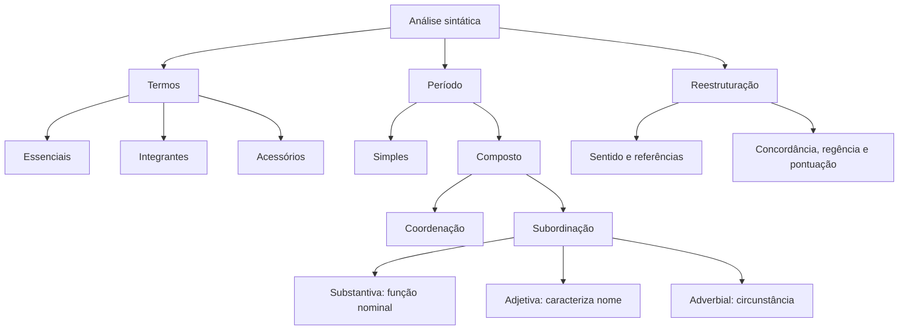

# Mapa mental — Módulo 6

## Perguntas de prova

- Quantos verbos e orações existem?
- Que função o termo ou oração exerce?
- Qual relação o conectivo expressa neste contexto?
- A pontuação altera o alcance?
- A reescrita preserva agentes, relações e correção?

[← Revisão](modulo-06-revisao.md){ .md-button } [Flashcards →](modulo-06-flashcards.md){ .md-button .md-button--primary }
