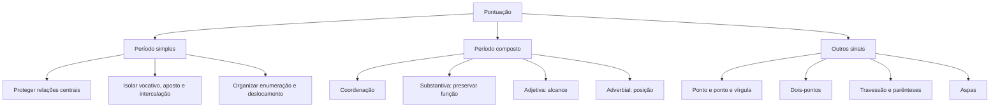

# Mapa mental — Módulo 7

```mermaid
flowchart TD
  A[Pontuação] --> B[Período simples]
  A --> C[Período composto]
  A --> D[Outros sinais]
  B --> B1[Proteger relações centrais]
  B --> B2[Isolar vocativo, aposto e intercalação]
  B --> B3[Organizar enumeração e deslocamento]
  C --> C1[Coordenação]
  C --> C2[Substantiva: preservar função]
  C --> C3[Adjetiva: alcance]
  C --> C4[Adverbial: posição]
  D --> D1[Ponto e ponto e vírgula]
  D --> D2[Dois-pontos]
  D --> D3[Travessão e parênteses]
  D --> D4[Aspas]
```

[← Revisão](modulo-07-revisao.md){ .md-button } [Flashcards →](modulo-07-flashcards.md){ .md-button .md-button--primary }
