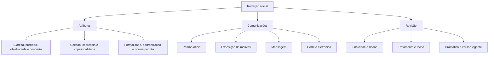

# Mapa mental — Módulo 8

```mermaid
flowchart TD
  A[Redação oficial] --> B[Atributos]
  A --> C[Comunicações]
  A --> D[Revisão]
  B --> B1[Clareza, precisão, objetividade e concisão]
  B --> B2[Coesão, coerência e impessoalidade]
  B --> B3[Formalidade, padronização e norma-padrão]
  C --> C1[Padrão ofício]
  C --> C2[Exposição de motivos]
  C --> C3[Mensagem]
  C --> C4[Correio eletrônico]
  D --> D1[Finalidade e dados]
  D --> D2[Tratamento e fecho]
  D --> D3[Gramática e versão vigente]
```

[← Revisão](modulo-08-revisao.md){ .md-button } [Flashcards →](modulo-08-flashcards.md){ .md-button .md-button--primary }
