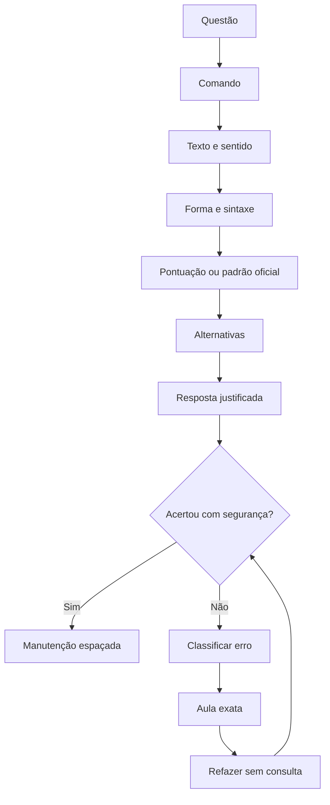

# Mapa mental — Módulo 9

```mermaid
flowchart TD
  A[Questão] --> B[Comando]
  B --> C[Texto e sentido]
  C --> D[Forma e sintaxe]
  D --> E[Pontuação ou padrão oficial]
  E --> F[Alternativas]
  F --> G[Resposta justificada]
  G --> H{Acertou com segurança?}
  H -- Sim --> I[Manutenção espaçada]
  H -- Não --> J[Classificar erro]
  J --> K[Aula exata]
  K --> L[Refazer sem consulta]
  L --> H
```

[← Revisão](modulo-09-revisao.md){ .md-button } [Flashcards essenciais →](modulo-09-flashcards.md){ .md-button .md-button--primary }
