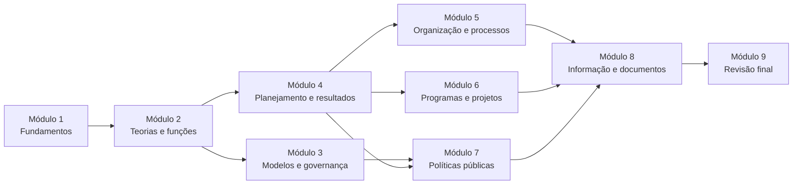

# Plano da disciplina — Administração Geral e Gestão Organizacional

## Controle do plano

| Campo | Definição |
|---|---|
| Concurso | SAPE/SC — Edital nº 001/2026 |
| Cargo | Analista Técnico Administrativo II |
| Fonte do conteúdo | Anexo 2, página 28, do edital consolidado pelas Retificações nº 01, nº 02 e nº 03 |
| Quantidade de módulos | 9 |
| Quantidade estimada de aulas | 46 |
| Carga total estimada | 92 horas |
| Situação | Disciplina produzida em 9 módulos, com 46 aulas e recursos de fechamento |

Este documento registra a organização da disciplina completa. O edital é o limite do conteúdo. As normas citadas nas aulas servem para explicar os itens expressos no programa. Elas não autorizam a inclusão de uma disciplina paralela de Direito Administrativo.

## Decisão de escopo

O nome da disciplina no edital é **Administração Geral e Gestão Organizacional**. O programa inclui fundamentos da Administração Pública, teorias administrativas, gestão, planejamento, projetos, processos, políticas públicas, dados e documentos.

Atos administrativos, poderes administrativos, agentes públicos, responsabilidade civil do Estado e serviços públicos não aparecem nesse programa. Licitações e contratos aparecem em outra disciplina: **Legislação e Ética na Administração Pública**. Por isso, esses assuntos não foram transformados em módulos de Administração Geral.

Essa escolha evita três problemas:

- estudar conteúdo que não foi pedido neste bloco;
- reduzir o tempo disponível para assuntos expressamente previstos;
- fazer a aluna confundir Administração Geral com Direito Administrativo.

!!! note "A palavra que pode confundir"
    O edital menciona **processo administrativo** ao lado de planejamento, organização, direção e controle. Nesse contexto, trata-se do trabalho de administrar uma organização. Não se trata do processo jurídico regulado pela Lei nº 9.784/1999.

## Objetivo da disciplina

Levar a aluna do primeiro contato com a Administração Pública até a capacidade de analisar organizações, planos, projetos, processos, políticas, indicadores e documentos públicos. Ao final, ela deverá reconhecer os conceitos do edital em situações concretas e escolher respostas sem depender apenas de palavras decoradas.

## Resultado esperado

Ao concluir a disciplina, a aluna deverá ser capaz de:

- explicar como a Administração Pública se organiza e atua;
- reconhecer as principais teorias e funções da Administração;
- comparar modelos de Administração Pública e governança;
- relacionar planejamento, metas, indicadores e resultados;
- analisar processos, projetos, programas e portfólios;
- compreender o ciclo das políticas públicas;
- ler dados, relatórios e painéis sem tirar conclusões apressadas;
- reconhecer os documentos administrativos previstos no edital;
- resolver questões que combinem dois ou mais desses assuntos.

## Visão geral da trilha

| Ordem | Módulo | Aulas | Tempo estimado | Função na trilha |
|---:|---|---:|---:|---|
| 1 | Fundamentos da Administração Pública | 5 | 10 h | Construir o vocabulário básico |
| 2 | Teorias, funções e estruturas administrativas | 5 | 10 h | Entender como as organizações são administradas |
| 3 | Modelos de Administração Pública e governança | 4 | 8 h | Comparar formas de atuação do Estado |
| 4 | Planejamento e gestão pública por resultados | 5 | 10 h | Ligar estratégia, execução e avaliação |
| 5 | Gestão organizacional, processos, qualidade e mudança | 5 | 10 h | Melhorar o funcionamento da organização |
| 6 | Programas, projetos e portfólios | 4 | 8 h | Organizar entregas temporárias e conjuntos de iniciativas |
| 7 | Políticas públicas | 6 | 12 h | Compreender problemas públicos e respostas do Estado |
| 8 | Informação, decisão, documentos e conhecimento | 8 | 16 h | Transformar dados e registros em decisões e memória institucional |
| 9 | Revisão final da disciplina | 4 | 8 h | Integrar, testar e preparar a semana da prova |
| **Total** |  | **46** | **92 h** |  |

O tempo inclui leitura orientada, pausas, revisão, flashcards e exercícios. Não é uma promessa de tempo exato. A aluna pode dividir uma aula em mais de um dia.

## Ordem pedagógica e dependências

Os módulos devem ser estudados na ordem indicada. O Módulo 3 e o Módulo 4 podem ser revistos em paralelo depois da primeira leitura. O Módulo 9 não apresenta matéria nova.

---

## Módulo 1 — Fundamentos da Administração Pública

### Objetivo

Construir a base necessária para compreender quem integra a Administração Pública, como suas partes se relacionam e quem pode tomar cada decisão.

### Competências desenvolvidas

- explicar os princípios da Administração Pública em linguagem simples;
- reconhecer a organização administrativa e o regime jurídico-administrativo;
- diferenciar Administração Direta, Administração Indireta, órgão e entidade;
- localizar a SAPE, a CIDASC e a EPAGRI na estrutura catarinense;
- analisar competência, delegação, avocação, hierarquia, vinculação e coordenação.

### Pré-requisitos

Nenhum. Este é o ponto de entrada da disciplina.

### Aulas

| Aula | Título | Tempo | Objetivo de aprendizagem |
|---:|---|---:|---|
| 1 | Princípios da Administração Pública | 90 min | Aplicar legalidade, impessoalidade, moralidade, publicidade e eficiência a situações concretas. |
| 2 | Organização administrativa e regime jurídico-administrativo | 90 min | Entender prerrogativas, limites e indisponibilidade do interesse público. |
| 3 | Administração direta e indireta | 90 min | Distinguir órgãos, autarquias, fundações, empresas públicas e sociedades de economia mista. |
| 4 | Administração Pública do Estado de Santa Catarina | 90 min | Reconhecer a estrutura estadual, a SAPE e os sistemas centrais, setoriais e seccionais. |
| 5 | Competências dos órgãos e entidades públicas | 90 min | Identificar quem pode agir e diferenciar competência, capacidade, delegação, avocação e coordenação. |

As cinco aulas já existentes ficam preservadas. A revisão, os flashcards, as questões comentadas e o simulado do módulo também permanecem como produtos de fechamento.

### Tempo estimado

10 horas: 7 horas e 30 minutos de aulas e 2 horas e 30 minutos de revisão e prática.

### Principais dificuldades

- aprender muitos nomes novos no início;
- separar órgão de entidade;
- compreender que uma vantagem jurídica da Administração também possui limites;
- localizar estruturas estaduais sem decorar siglas soltas.

### Pontos normalmente confundidos

- interesse público não significa vontade pessoal do agente;
- descentralização não é desconcentração;
- vinculação não é hierarquia;
- autarquia é criada por lei; empresa pública e sociedade de economia mista têm a criação autorizada por lei;
- capacidade jurídica não é competência administrativa.

Esses são pontos de confusão conceitual. Só poderão ser chamados de “pegadinhas da FEPESE” quando a análise prevista no `FEPESE_GUIDE.md` fornecer evidência suficiente.

### Estratégia pedagógica

Começar por situações comuns de atendimento público. Apresentar cada palavra técnica somente depois da explicação simples. Usar comparações visuais, exemplos de Santa Catarina e perguntas curtas durante a leitura.

### Produtos sugeridos

- 40 questões de treino, distribuídas pelas cinco aulas;
- 40 flashcards curtos;
- 1 simulado de módulo;
- 1 revisão de 5 minutos;
- 1 mapa mental.

### Critérios de conclusão

- obter pelo menos 80% nas questões essenciais;
- explicar, sem consultar o texto, as diferenças entre órgão e entidade, Direta e Indireta, delegação e avocação;
- refazer todos os erros e indicar a aula que resolve cada um;
- concluir a revisão e o simulado.

---

## Módulo 2 — Teorias, funções e estruturas administrativas

### Objetivo

Mostrar como as ideias sobre Administração evoluíram e como planejar, organizar, dirigir e controlar aparecem no trabalho diário.

### Competências desenvolvidas

- reconhecer contribuições e limites das principais teorias administrativas;
- identificar cada função do processo administrativo;
- comparar estruturas organizacionais;
- explicar centralização e descentralização da decisão;
- relacionar teoria, estrutura e prática.

### Pré-requisitos

Módulo 1, especialmente organização, hierarquia e competência.

### Aulas

| Aula | Título | Tempo | Objetivo de aprendizagem |
|---:|---|---:|---|
| 1 | Por que surgiram as teorias da Administração | 90 min | Entender o problema que cada teoria tentou resolver. |
| 2 | Abordagens clássica, científica e burocrática | 90 min | Comparar eficiência do trabalho, estrutura e regras formais. |
| 3 | Relações humanas, comportamento e visão sistêmica | 90 min | Reconhecer pessoas, grupos, ambiente e interação entre as partes. |
| 4 | Processo administrativo: planejar, organizar, dirigir e controlar | 90 min | Identificar as quatro funções em casos concretos. |
| 5 | Estruturas organizacionais, centralização e descentralização | 90 min | Comparar formas de distribuir unidades e decisões. |

### Tempo estimado

10 horas: 7 horas e 30 minutos de aulas e 2 horas e 30 minutos de revisão e prática.

### Principais dificuldades

- decorar nomes sem entender o problema resolvido;
- misturar teoria burocrática com Administração Pública burocrática;
- confundir o processo de administrar com processo jurídico;
- separar desenho da estrutura e distribuição da decisão.

### Pontos normalmente confundidos

- eficiência do trabalho e atenção às pessoas não são explicações idênticas;
- planejar vem antes de executar, mas controle acompanha a execução;
- estrutura funcional, divisional e matricial usam critérios diferentes;
- descentralização decisória neste módulo não muda, por si só, a personalidade jurídica.

### Estratégia pedagógica

Apresentar uma organização fictícia que cresce e enfrenta novos problemas. Cada teoria entra como resposta a um desses problemas. Depois, usar o mesmo caso para mostrar funções, estrutura e distribuição das decisões.

### Produtos sugeridos

- 40 questões;
- 36 flashcards;
- 1 simulado de módulo;
- 1 revisão de 5 minutos;
- 1 quadro comparativo das teorias.

### Critérios de conclusão

- reconhecer a teoria ou função descrita sem depender do nome no enunciado;
- montar a sequência planejar, organizar, dirigir e controlar para um caso simples;
- comparar ao menos três estruturas;
- alcançar 80% nas questões essenciais e revisar os erros.

---

## Módulo 3 — Modelos de Administração Pública e governança

### Objetivo

Explicar como diferentes modelos organizam a relação entre Estado, resultados, controle e participação social.

### Competências desenvolvidas

- comparar os modelos patrimonialista, burocrático, gerencial e societal;
- compreender a Nova Gestão Pública;
- explicar governança pública em linguagem simples;
- analisar a convivência de características de modelos diferentes.

### Pré-requisitos

Módulos 1 e 2, com atenção à teoria burocrática, princípios e funções administrativas.

### Aulas

| Aula | Título | Tempo | Objetivo de aprendizagem |
|---:|---|---:|---|
| 1 | Modelos patrimonialista e burocrático | 90 min | Diferenciar confusão entre público e privado de formalização e controle. |
| 2 | Modelo gerencial e Nova Gestão Pública | 90 min | Relacionar desempenho, resultados, autonomia e responsabilização. |
| 3 | Modelo societal e participação | 90 min | Entender a presença da sociedade na construção e no controle da ação pública. |
| 4 | Governança pública | 90 min | Reconhecer direção, estratégia, supervisão e prestação de contas. |

### Tempo estimado

8 horas: 6 horas de aulas e 2 horas de revisão e prática.

### Principais dificuldades

- tratar os modelos como fases que desaparecem completamente;
- confundir gestão com governança;
- concluir que foco em resultados elimina regras e controles.

### Pontos normalmente confundidos

- burocracia como modelo técnico e “burocracia” como demora cotidiana;
- governança e governabilidade;
- participação social e transferência integral da decisão estatal;
- autonomia administrativa e ausência de responsabilidade.

### Estratégia pedagógica

Usar a evolução de um mesmo serviço público. Mostrar como cada modelo mudaria regras, decisões, resultados e participação. Fechar com uma tabela que compare finalidade, instrumentos, força e limite de cada modelo.

### Produtos sugeridos

- 30 questões;
- 28 flashcards;
- 1 simulado de módulo;
- 1 revisão de 5 minutos;
- 1 mapa mental comparativo.

### Critérios de conclusão

- identificar o modelo a partir de um comportamento concreto;
- explicar por que características de mais de um modelo podem coexistir;
- diferenciar gestão e governança;
- obter 80% nas questões essenciais.

---

## Módulo 4 — Planejamento e gestão pública por resultados

### Objetivo

Ensinar como uma intenção pública se transforma em objetivos, ações, metas, indicadores, acompanhamento e avaliação.

### Competências desenvolvidas

- diferenciar níveis estratégico, tático e operacional;
- compreender planejamento governamental e instrumentos de planejamento público;
- formular objetivos, metas e indicadores coerentes;
- acompanhar execução e avaliar resultados;
- reconhecer a gestão estratégica no setor público.

### Pré-requisitos

Módulo 2, especialmente planejamento e controle; Módulo 3, especialmente modelo gerencial e governança.

### Aulas

| Aula | Título | Tempo | Objetivo de aprendizagem |
|---:|---|---:|---|
| 1 | Planejamento estratégico | 90 min | Relacionar missão, visão, diagnóstico, objetivos e escolhas. |
| 2 | Níveis estratégico, tático e operacional | 90 min | Transformar uma direção geral em planos de áreas e tarefas. |
| 3 | Planejamento governamental e instrumentos públicos | 90 min | Entender a função dos instrumentos sem antecipar a disciplina de orçamento. |
| 4 | Gestão estratégica e gestão por resultados | 90 min | Ligar prioridades públicas a entregas e efeitos esperados. |
| 5 | Metas, indicadores, monitoramento e avaliação | 90 min | Escolher medidas úteis e interpretar o acompanhamento de um plano. |

### Tempo estimado

10 horas: 7 horas e 30 minutos de aulas e 2 horas e 30 minutos de revisão e prática.

### Principais dificuldades

- confundir objetivo, meta e indicador;
- tratar planejamento como documento parado;
- misturar monitoramento e avaliação;
- aprofundar regras orçamentárias que pertencem a outra disciplina.

### Pontos normalmente confundidos

- missão, visão e objetivo;
- produto entregue e resultado produzido;
- indicador e meta;
- monitorar durante a execução e avaliar o valor do resultado;
- planejamento público e orçamento público.

### Estratégia pedagógica

Usar um plano público simples, como reduzir o tempo de atendimento rural. Construir com a aluna o diagnóstico, o objetivo, a meta, as ações, o indicador e a forma de acompanhar.

### Produtos sugeridos

- 40 questões;
- 36 flashcards;
- 1 simulado de módulo;
- 1 revisão de 5 minutos;
- 1 quadro “objetivo, meta, indicador e resultado”.

### Critérios de conclusão

- transformar um problema em objetivo e meta mensurável;
- escolher um indicador coerente;
- separar os três níveis de planejamento;
- obter 80% nas questões essenciais e corrigir todos os erros.

---

## Módulo 5 — Gestão organizacional, processos, qualidade e mudança

### Objetivo

Ensinar a observar como o trabalho flui, encontrar falhas e melhorar a organização sem perder a finalidade pública.

### Competências desenvolvidas

- compreender gestão por processos;
- mapear, analisar e melhorar um processo;
- aplicar noções de gestão da qualidade;
- diferenciar eficiência, eficácia e efetividade;
- compreender mudança organizacional e suas resistências.

### Pré-requisitos

Módulo 2, especialmente estruturas e funções; Módulo 4, especialmente metas, indicadores e avaliação.

### Aulas

| Aula | Título | Tempo | Objetivo de aprendizagem |
|---:|---|---:|---|
| 1 | Gestão por processos | 90 min | Enxergar o fluxo de trabalho de ponta a ponta. |
| 2 | Mapeamento e análise de processos | 90 min | Registrar etapas, responsáveis, entradas, saídas e problemas. |
| 3 | Melhoria de processos e gestão da qualidade | 90 min | Escolher mudanças e verificar se elas melhoraram a entrega. |
| 4 | Eficiência, eficácia e efetividade | 90 min | Diferenciar uso de recursos, alcance da meta e efeito produzido. |
| 5 | Gestão da mudança organizacional | 90 min | Reconhecer causas de resistência e planejar uma mudança possível. |

### Tempo estimado

10 horas: 7 horas e 30 minutos de aulas e 2 horas e 30 minutos de revisão e prática.

### Principais dificuldades

- olhar apenas para departamentos e não para o fluxo completo;
- pensar que qualidade significa perfeição sem medida;
- confundir eficiência, eficácia e efetividade;
- tratar resistência como simples má vontade.

### Pontos normalmente confundidos

- processo, projeto e rotina;
- mapear o processo e melhorar o processo;
- fazer com menos recursos e produzir o efeito social desejado;
- comunicar a mudança e realmente preparar pessoas e trabalho.

### Estratégia pedagógica

Acompanhar um pedido desde a entrada até a entrega. Marcar espera, retrabalho e decisão. Só depois apresentar os termos técnicos e as ferramentas de melhoria.

### Produtos sugeridos

- 40 questões;
- 36 flashcards;
- 1 simulado de módulo;
- 1 revisão de 5 minutos;
- 1 mapa de processo comentado.

### Critérios de conclusão

- desenhar um processo simples com começo, etapas e resultado;
- propor uma melhoria ligada a um problema observado;
- diferenciar eficiência, eficácia e efetividade em novos exemplos;
- obter 80% nas questões essenciais.

---

## Módulo 6 — Programas, projetos e portfólios

### Objetivo

Mostrar como a Administração organiza iniciativas com objetivos, prazos, recursos e acompanhamento.

### Competências desenvolvidas

- diferenciar programa, projeto, processo e portfólio;
- reconhecer características e ciclo de vida de um projeto;
- planejar execução, prazos, recursos, riscos e responsáveis;
- monitorar metas, indicadores e resultados;
- compreender a gestão de portfólio.

### Pré-requisitos

Módulos 4 e 5.

### Aulas

| Aula | Título | Tempo | Objetivo de aprendizagem |
|---:|---|---:|---|
| 1 | Programas, projetos, processos e ciclo de vida | 90 min | Distinguir os conceitos e reconhecer as etapas de um projeto. |
| 2 | Planejamento e execução de projetos | 90 min | Organizar objetivo, entrega, prazo, responsáveis, recursos e riscos. |
| 3 | Monitoramento, avaliação, metas, indicadores e resultados | 90 min | Acompanhar o andamento e avaliar a entrega do projeto. |
| 4 | Gestão de portfólio | 90 min | Priorizar e acompanhar um conjunto de projetos e programas. |

### Tempo estimado

8 horas: 6 horas de aulas e 2 horas de revisão e prática.

### Principais dificuldades

- chamar qualquer atividade de projeto;
- confundir programa e portfólio;
- acompanhar apenas prazo e esquecer resultado;
- tratar risco como problema que já aconteceu.

### Pontos normalmente confundidos

- projeto temporário e processo contínuo;
- entrega, meta e resultado;
- programa formado por iniciativas relacionadas e portfólio guiado por prioridade estratégica;
- monitoramento e avaliação.

### Estratégia pedagógica

Planejar um projeto público curto do início ao encerramento. Depois ampliar a visão para um programa e um portfólio, mostrando por que a decisão muda em cada nível.

### Produtos sugeridos

- 35 questões;
- 32 flashcards;
- 1 simulado de módulo;
- 1 revisão de 5 minutos;
- 1 quadro comparativo de programa, projeto, processo e portfólio.

### Critérios de conclusão

- classificar corretamente exemplos de programa, projeto, processo e portfólio;
- montar um plano básico de projeto;
- escolher medidas de acompanhamento coerentes;
- obter 80% nas questões essenciais.

---

## Módulo 7 — Políticas públicas

### Objetivo

Explicar como um problema coletivo entra na agenda, recebe uma resposta do Estado e tem seus resultados avaliados.

### Competências desenvolvidas

- explicar conceitos, fundamentos e tipos de políticas públicas;
- reconhecer as etapas do ciclo;
- formular um problema público com base em diagnóstico;
- comparar instrumentos de intervenção estatal;
- compreender implementação, monitoramento e avaliação;
- diferenciar resultado e impacto.

### Pré-requisitos

Módulo 3, para modelos e governança; Módulo 4, para planejamento e indicadores; Módulo 6, para programas e projetos.

### Aulas

| Aula | Título | Tempo | Objetivo de aprendizagem |
|---:|---|---:|---|
| 1 | Conceitos, fundamentos e tipos de políticas públicas | 90 min | Reconhecer o que caracteriza uma política pública e suas classificações. |
| 2 | Ciclo das políticas públicas e formação da agenda | 90 min | Entender por que alguns problemas recebem atenção do governo. |
| 3 | Diagnóstico e formulação | 90 min | Definir o problema, suas causas, o público e as opções de resposta. |
| 4 | Implementação e instrumentos de intervenção estatal | 90 min | Comparar formas de colocar a política em prática. |
| 5 | Monitoramento e avaliação | 90 min | Acompanhar execução e julgar resultados com critérios claros. |
| 6 | Avaliação de resultados e de impacto | 90 min | Diferenciar mudança observada de mudança causada pela política. |

### Tempo estimado

12 horas: 9 horas de aulas e 3 horas de revisão e prática.

### Principais dificuldades

- confundir problema público com a solução preferida;
- tratar o ciclo como sequência rígida;
- misturar política, programa e projeto;
- afirmar que uma política causou um efeito apenas porque os dois ocorreram juntos.

### Pontos normalmente confundidos

- agenda pública e agenda governamental;
- formulação e implementação;
- instrumento e objetivo;
- resultado e impacto;
- associação entre fatos e relação de causa.

### Estratégia pedagógica

Usar um problema próximo da atuação da SAPE, sem antecipar a disciplina específica de desenvolvimento rural. Percorrer o ciclo e perguntar, em cada etapa, quem decide, que informação falta e como saber se a ação funcionou.

### Produtos sugeridos

- 50 questões;
- 44 flashcards;
- 1 simulado de módulo;
- 1 revisão de 5 minutos;
- 1 mapa do ciclo com alertas sobre idas e voltas.

### Critérios de conclusão

- formular um problema sem esconder nele uma solução;
- localizar uma situação em uma etapa do ciclo;
- comparar instrumentos de intervenção;
- explicar a diferença entre resultado e impacto;
- obter 80% nas questões essenciais.

---

## Módulo 8 — Informação, decisão, documentos e conhecimento

### Objetivo

Ensinar a organizar dados e documentos, produzir informação útil e apoiar decisões responsáveis na Administração Pública.

### Competências desenvolvidas

- coletar, organizar, tratar e interpretar dados;
- ler indicadores e noções de estatística descritiva;
- compreender relatórios, painéis e ferramentas de acompanhamento;
- tomar decisões apoiadas em evidências e reconhecer limites dos dados;
- organizar documentos, informações e protocolos;
- aplicar noções de arquivologia;
- distinguir relatório, parecer, nota técnica e outros documentos administrativos;
- compreender gestão do conhecimento.

### Pré-requisitos

Módulos 4 a 7, que fornecem metas, processos, projetos e políticas para os exemplos.

### Aulas

| Aula | Título | Tempo | Objetivo de aprendizagem |
|---:|---|---:|---|
| 1 | Coleta, organização e tratamento de dados | 90 min | Preparar dados para uso sem esconder falhas ou mudar seu sentido. |
| 2 | Interpretação de dados, indicadores e estatística descritiva | 90 min | Ler medidas simples e evitar conclusões além do que os dados permitem. |
| 3 | Relatórios, painéis e ferramentas de acompanhamento | 90 min | Escolher a apresentação adequada para monitorar ações e resultados. |
| 4 | Tomada de decisão baseada em evidências | 90 min | Combinar dados, contexto, limites e responsabilidade decisória. |
| 5 | Gestão de documentos e informações | 90 min | Organizar o ciclo dos documentos e permitir acesso seguro à informação. |
| 6 | Protocolo e noções de arquivologia | 90 min | Registrar a movimentação e reconhecer funções básicas dos arquivos. |
| 7 | Relatórios, pareceres, notas técnicas e documentos administrativos | 90 min | Escolher o documento adequado e entender sua função. |
| 8 | Gestão do conhecimento | 90 min | Preservar e compartilhar o que a organização aprende. |

### Tempo estimado

16 horas: 12 horas de aulas e 4 horas de revisão e prática.

### Principais dificuldades

- confundir dado com informação pronta;
- calcular uma medida sem saber interpretá-la;
- acreditar que um painel decide sozinho;
- misturar os usos de parecer, relatório e nota técnica;
- decorar termos de arquivo sem compreender o caminho do documento.

### Pontos normalmente confundidos

- média, mediana e moda;
- indicador e dado isolado;
- relação entre dois fatos e prova de causa;
- protocolo e arquivo;
- relatório descritivo, parecer opinativo e nota técnica fundamentada;
- informação registrada e conhecimento usado pelas pessoas.

### Estratégia pedagógica

Começar com uma pequena planilha e um conjunto de documentos de um caso fictício. Transformar registros em indicador, relatório e decisão. Depois acompanhar o documento do recebimento ao arquivamento e mostrar como o aprendizado pode ser preservado.

### Produtos sugeridos

- 60 questões;
- 52 flashcards;
- 1 simulado de módulo;
- 1 revisão de 5 minutos;
- 2 mapas mentais: dados e decisão; documentos e conhecimento.

### Critérios de conclusão

- interpretar tabelas e medidas descritivas simples;
- apontar limites de uma conclusão baseada em dados;
- escolher o documento administrativo adequado para um caso;
- explicar o caminho básico de um documento;
- obter 80% nas questões essenciais.

---

## Módulo 9 — Revisão final da disciplina

### Objetivo

Integrar toda a disciplina, localizar pontos frágeis e chegar à prova com um plano curto e seguro de revisão.

### Competências desenvolvidas

- conectar assuntos de módulos diferentes;
- recuperar conceitos sem consultar a resposta;
- identificar e corrigir padrões pessoais de erro;
- administrar tempo e atenção em um simulado;
- preparar a revisão da semana da prova.

### Pré-requisitos

Módulos 1 a 8 concluídos, com registros de acertos e erros.

### Aulas

| Aula | Título | Tempo | Objetivo de aprendizagem |
|---:|---|---:|---|
| 1 | Revisão geral e mapas mentais | 90 min | Reconstruir a disciplina em blocos conectados, sem apresentar conteúdo novo. |
| 2 | Flashcards finais e pontos comprovados em provas da FEPESE | 90 min | Revisar conceitos essenciais e separar evidência de impressão sobre a banca. |
| 3 | Normas essenciais, checklist final e correção de erros | 90 min | Retomar apenas os trechos normativos ligados ao edital e fechar lacunas pessoais. |
| 4 | Simulado final e plano da semana da prova | 90 min | Testar a integração dos assuntos e montar uma revisão realista. |

### Tempo estimado

8 horas: 6 horas de encontros de revisão e 2 horas para simulado e correção complementar.

### Principais dificuldades

- reler tudo sem testar a memória;
- gastar o mesmo tempo em assuntos fortes e fracos;
- decorar uma lista de “pegadinhas” sem fonte;
- estudar matéria nova na semana da prova.

### Pontos normalmente confundidos

O módulo retomará apenas confusões demonstradas pelos erros da aluna e pelas questões oficiais analisadas. Uma característica só será atribuída à FEPESE quando cumprir os critérios do `FEPESE_GUIDE.md`. Se a amostra for pequena, o material dirá isso de forma clara.

### Estratégia pedagógica

Alternar recuperação sem consulta, mapas, questões mistas e retorno direcionado à aula de origem. A revisão começa pelos erros registrados, não pela releitura integral do curso.

### Produtos sugeridos

- 80 flashcards finais selecionados dos módulos, sem duplicação desnecessária;
- 40 questões mistas de revisão;
- 1 simulado diagnóstico curto;
- 1 simulado final de 40 questões, identificado como exercício da disciplina e não como reprodução da distribuição oficial da prova;
- 1 checklist final;
- 1 plano para os sete dias anteriores à prova.

### Critérios de conclusão

- obter pelo menos 80% no simulado final;
- explicar cada erro e indicar o módulo de retorno;
- revisar todos os cartões marcados como difíceis;
- concluir o checklist sem lacunas essenciais;
- ter um plano da semana da prova que inclua descanso.

---

## Matriz integral: edital, módulo e aula

| Conteúdo do edital | Cobertura planejada |
|---|---|
| Princípios da Administração Pública | M1, Aula 1 |
| Organização Administrativa | M1, Aula 2 |
| Regime jurídico-administrativo | M1, Aula 2 |
| Administração direta e indireta | M1, Aula 3 |
| Administração Pública do Estado de Santa Catarina | M1, Aula 4 |
| Competências dos órgãos e entidades públicas | M1, Aula 5 |
| Teorias administrativas | M2, Aulas 1 a 3 |
| Processo administrativo: planejamento, organização, direção e controle | M2, Aula 4 |
| Estruturas organizacionais | M2, Aula 5 |
| Centralização e descentralização | M2, Aula 5, com base conceitual no M1 |
| Modelos de Administração Pública | M3, Aulas 1 a 3 |
| Modelos burocrático, gerencial e societal | M3, Aulas 1 a 3 |
| Nova Gestão Pública | M3, Aula 2 |
| Governança pública | M3, Aula 4 |
| Planejamento estratégico | M4, Aulas 1 e 2 |
| Planejamento governamental | M4, Aula 3 |
| Instrumentos de planejamento público | M4, Aula 3 |
| Gestão estratégica no setor público | M4, Aula 4 |
| Gestão por resultados | M4, Aula 4 |
| Monitoramento e avaliação | M4, Aula 5; aplicado também nos M6 e M7 |
| Gestão por processos | M5, Aula 1 |
| Gestão da qualidade | M5, Aula 3 |
| Gestão da mudança | M5, Aula 5 |
| Eficiência, eficácia e efetividade | M5, Aula 4 |
| Conceitos, características e ciclo de vida de programas, projetos e processos | M6, Aula 1; processos aprofundados no M5 |
| Planejamento e execução | M6, Aula 2 |
| Monitoramento e avaliação | M6, Aula 3 |
| Metas, indicadores e resultados | M6, Aula 3 |
| Mapeamento, análise e melhoria de processos | M5, Aulas 2 e 3 |
| Gestão de portfólio | M6, Aula 4 |
| Conceitos e fundamentos de políticas públicas | M7, Aula 1 |
| Tipos de políticas públicas | M7, Aula 1 |
| Ciclo das políticas públicas | M7, Aula 2 |
| Formulação, implementação, monitoramento e avaliação | M7, Aulas 3 a 5 |
| Diagnóstico de problemas públicos | M7, Aula 3 |
| Instrumentos de intervenção estatal | M7, Aula 4 |
| Avaliação de resultados e de impacto | M7, Aula 6 |
| Coleta, organização, tratamento e interpretação de dados | M8, Aulas 1 e 2 |
| Indicadores | M8, Aula 2, com base no M4 |
| Noções de estatística descritiva | M8, Aula 2 |
| Relatórios, painéis e ferramentas de acompanhamento | M8, Aula 3 |
| Tomada de decisão baseada em evidências | M8, Aula 4 |
| Gestão de documentos e informações | M8, Aula 5 |
| Protocolo | M8, Aula 6 |
| Noções de arquivologia | M8, Aula 6 |
| Relatórios, pareceres, notas técnicas e documentos administrativos | M8, Aula 7 |
| Gestão do conhecimento | M8, Aula 8 |

## Validação contra o edital

### Tópicos cobertos

Todos os itens de **Administração Geral e Gestão Organizacional** do Anexo 2, página 28, possuem destino explícito na matriz acima. A cobertura planejada é de **100% dos tópicos expressos**.

### Tópicos sem módulo

Não há tópico expresso da disciplina sem módulo ou aula planejada.

### Conteúdo que ficaria além do edital

| Tema sugerido inicialmente | Situação no edital | Decisão |
|---|---|---|
| Atos administrativos | Não consta em Administração Geral | Não incluir nesta disciplina |
| Poderes administrativos | Não consta em Administração Geral | Não incluir; hierarquia será tratada apenas no limite necessário à organização |
| Agentes públicos | Não consta em Administração Geral | Não incluir; normas de servidores pertencem ao bloco de Legislação e Ética |
| Licitações e contratos; Lei nº 14.133/2021 | Consta em Legislação e Ética, não em Administração Geral | Planejar na disciplina correta |
| Controle administrativo, judicial e social | Não consta como bloco jurídico em Administração Geral | Tratar somente monitoramento, avaliação, governança e participação previstos |
| Responsabilidade civil do Estado | Não consta em Administração Geral | Não incluir nesta disciplina |
| Serviços públicos, concessão, permissão e autorização | Não constam em Administração Geral | Não incluir nesta disciplina |

Essas exclusões não afirmam que os temas sejam pouco importantes em outros concursos. Significam apenas que não integram este programa específico de Administração Geral.

### Oportunidades de reorganização adotadas

- O antigo conteúdo de mapeamento e melhoria de processos foi reunido à gestão organizacional no Módulo 5. Assim, a aluna estuda o fluxo antes de estudar projetos e portfólios.
- Informação, documentos e conhecimento foram reunidos no Módulo 8. A sequência passa do dado recebido à decisão, ao registro e à memória da organização.
- O Módulo 9 tornou-se uma revisão final verdadeira. Ele não reduz a cobertura porque os dois antigos blocos finais foram integrados ao Módulo 8.
- Planejamento público será apresentado sem repetir o aprofundamento jurídico e financeiro de Administração Financeira e Orçamentária.
- Os exemplos rurais poderão aproximar a matéria do cargo, mas não substituirão o estudo próprio de Políticas Públicas para o Desenvolvimento Rural e Agropecuário.

## Estratégia geral de revisão

- **Após cada aula:** resumo, checklist, exercícios e flashcards da própria aula.
- **Após cada módulo:** revisão de 5 minutos, mapa mental, questões mistas e simulado curto.
- **Depois de 7 e 30 dias:** retorno guiado pelos erros e pelos cartões difíceis, sem releitura automática de tudo.
- **Ao final da disciplina:** Módulo 9, com integração, simulado e plano da semana da prova.

Os intervalos são recomendações. O plano deve ser adaptado ao tempo real da aluna sem transformar atraso em culpa.

## Estratégia geral de questões

As questões devem seguir o `QUESTION_GUIDE.md` e o `FEPESE_GUIDE.md`:

- priorizar questões oficiais verificáveis e realmente relacionadas ao item estudado;
- identificar adaptações com clareza;
- criar questões autorais somente para completar cobertura ou treinar uma habilidade;
- comentar cada alternativa com motivo concreto;
- distribuir dificuldade e letras corretas sem formar padrões;
- registrar a aula que resolve cada erro;
- não atribuir comportamento à FEPESE com base em uma única questão.

## Estratégia geral de flashcards

- uma pergunta por cartão;
- resposta curta e suficiente;
- prioridade para conceitos confundidos, sequências e comparações;
- poucos cartões para listas; mais cartões para decisões que a aluna precisa tomar;
- retirada de cartões dominados e reforço dos que continuam difíceis;
- seleção final de até 80 cartões essenciais no Módulo 9.

## Critério de conclusão da disciplina

A disciplina estará concluída quando a aluna:

- tiver completado os nove módulos;
- alcançar 80% ou mais no simulado final;
- conseguir explicar os erros sem apenas repetir o gabarito;
- não deixar tópico da matriz sem revisão;
- souber onde retornar quando surgir uma dúvida;
- terminar com um plano simples para a semana da prova.

## Justificativa pedagógica

A ordem vai do concreto para o integrado. Primeiro, a aluna entende quem compõe a Administração e quem pode agir. Depois, aprende como organizações funcionam, como o Estado escolhe modelos, como planeja, como melhora processos e como executa projetos. Só então estuda políticas públicas, dados e documentos. A revisão final reúne tudo sem introduzir matéria nova.

Essa sequência reduz a quantidade de palavras novas apresentadas de uma vez. Também cria dependências claras: indicadores aparecem depois de metas; avaliação de impacto aparece depois de políticas; documentos e relatórios aparecem depois das decisões que precisam apoiar e registrar.

## Limites deste planejamento

- O edital informa 40 questões de Conhecimentos Específicos com peso 0,15 cada, mas não informa quantas serão de cada uma das quatro disciplinas específicas. Portanto, não existe percentual oficial exclusivo para Administração Geral.
- A quantidade de aulas, horas, questões e flashcards é uma decisão pedagógica do curso, não uma regra do edital.
- Padrões de cobrança e pegadinhas da FEPESE só serão incluídos após análise de amostra oficial suficiente.
- A produção das aulas futuras deverá conferir novamente legislação, referências e eventuais novas retificações antes da publicação.
