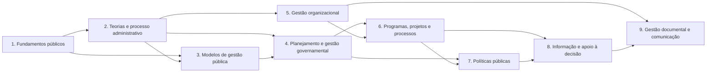

# Plano da disciplina — Administração Geral e Gestão Organizacional

## Natureza do documento

Este é o projeto pedagógico da disciplina. Ele define cobertura, sequência, objetivos e estratégias de aprendizagem. Não contém aulas nem acrescenta assuntos ao programa oficial.

**Fonte de escopo:** Edital 001/2026 da SAPE/SC, Anexo 2, página 28, consolidado com os Termos de Retificação nº 01, nº 02 e nº 03. A transcrição está no [`EDITAL.md` do repositório](https://github.com/vmedinax/curso-sape-sc-2026/blob/main/EDITAL.md), e a arquitetura geral está em [`MAPA_DO_CURSO.md`](../MAPA_DO_CURSO.md).

O edital inclui esta disciplina no conjunto de Conhecimentos Específicos. Esse conjunto tem 35 questões, vale 7,00 pontos e representa 70% da prova. O edital não informa quantas questões serão destinadas a Administração Geral e Gestão Organizacional. Portanto, qualquer prioridade individual é editorial, não oficial.

## 1. Objetivo da disciplina

Levar o aluno, mesmo sem formação prévia em Administração, a compreender como organizações públicas são estruturadas, dirigidas, planejadas, acompanhadas e melhoradas. Ao final, ele deverá reconhecer conceitos, comparar modelos, analisar situações administrativas e selecionar instrumentos adequados para estratégia, processos, projetos, políticas públicas, informação, documentos e apoio à decisão.

A disciplina será construída do concreto para o técnico. Cada aula partirá de uma situação plausível de organização pública ou empresa. Depois, apresentará o conceito, suas diferenças em relação a conceitos próximos e sua aplicação em questões.

## 2. Dimensão e carga planejada

| Elemento | Planejamento |
|---|---:|
| Módulos | 9 |
| Aulas | 42 |
| Duração média por aula | 90 minutos |
| Estudo inicial | 63 horas |
| Revisões, exercícios cumulativos e simulado da disciplina | 21 horas sugeridas |
| Carga total sugerida | 84 horas |
| Dificuldade relativa | 4 de 5 |

Os 90 minutos de cada aula abrangem leitura ativa, recuperação sem consulta e exercícios iniciais. A carga adicional cobre revisões espaçadas e blocos cumulativos.

## 3. Relação completa entre edital, módulos e aulas

| Conteúdo literal ou unidade de sentido do edital | Módulo | Aula(s) |
|---|---:|---|
| Princípios da Administração Pública | 1 | 1.1 |
| Organização administrativa | 1 | 1.2 |
| Regime jurídico-administrativo | 1 | 1.2 |
| Administração direta e indireta | 1 | 1.3 |
| Administração Pública do Estado de Santa Catarina | 1 | 1.4 |
| Competências dos órgãos e entidades públicas | 1 | 1.5 |
| Teorias da administração | 2 | 2.1 |
| Processo administrativo | 2 | 2.2 e 2.3 |
| Planejamento, organização, direção e controle | 2 | 2.2 e 2.3 |
| Estruturas organizacionais | 2 | 2.4 |
| Centralização e descentralização | 2 | 2.5 |
| Modelos de administração pública | 3 | 3.1 |
| Administração pública burocrática, gerencial e societária | 3 | 3.2 |
| Nova Gestão Pública | 3 | 3.3 |
| Governança pública | 3 | 3.4 |
| Planejamento estratégico | 4 | 4.1 |
| Planejamento governamental | 4 | 4.2 |
| Instrumentos de planejamento da Administração Pública | 4 | 4.2 |
| Gestão estratégica no setor público | 4 | 4.3 |
| Gestão orientada para resultados | 4 | 4.4 |
| Monitoramento e avaliação da ação governamental | 4 | 4.5 |
| Gestão por processos | 5 | 5.1 |
| Gestão da qualidade | 5 | 5.2 |
| Gestão da mudança organizacional | 5 | 5.3 |
| Eficiência, eficácia e efetividade | 5 | 5.4 |
| Conceitos, características e ciclo de vida de programas e projetos | 6 | 6.1 |
| Planejamento, execução, monitoramento e avaliação | 6 | 6.2 e 6.3 |
| Metas, indicadores e resultados | 6 | 6.3 |
| Mapeamento, análise e melhoria de processos organizacionais | 6 | 6.4 |
| Gestão de portfólio de projetos | 6 | 6.5 |
| Políticas públicas: conceitos, fundamentos e tipologias | 7 | 7.1 |
| Ciclo das políticas públicas | 7 | 7.2 |
| Formulação e implementação | 7 | 7.3 |
| Monitoramento e avaliação | 7 | 7.4 |
| Diagnóstico de problemas públicos | 7 | 7.5 |
| Instrumentos de intervenção estatal | 7 | 7.5 |
| Avaliação de resultados e impactos das políticas públicas | 7 | 7.6 |
| Coleta, organização, tratamento e interpretação de dados | 8 | 8.1 |
| Indicadores gerenciais | 8 | 8.2 |
| Estatística descritiva aplicada à gestão pública | 8 | 8.2 |
| Elaboração de relatórios, painéis gerenciais e instrumentos de acompanhamento | 8 | 8.3 |
| Apoio à tomada de decisão baseada em evidências | 8 | 8.4 |
| Gestão de documentos e informações | 9 | 9.1 |
| Protocolo | 9 | 9.2 |
| Arquivologia aplicada à Administração Pública | 9 | 9.2 |
| Produção de relatórios, pareceres, notas técnicas e documentos administrativos | 9 | 9.3 |
| Gestão do conhecimento organizacional | 9 | 9.4 |

Esta matriz é o controle de cobertura. Uma aula só poderá ser aprovada quando seus itens estiverem efetivamente ensinados e verificados. A mera menção ao termo não comprova cobertura.

## 4. Ordem pedagógica ideal

A ordem foi definida pelas dependências conceituais, não pela ordem aleatória de possíveis questões.

1. **Fundamentos da Administração Pública:** estabelece o que é a organização pública e como competências são distribuídas.
2. **Teorias e processo administrativo:** apresenta as funções básicas de administrar e as formas de estruturar o trabalho.
3. **Modelos de gestão pública:** permite comparar formas históricas e contemporâneas de organizar a atuação estatal.
4. **Planejamento e gestão governamental:** transforma finalidade institucional em direção, objetivos e acompanhamento.
5. **Gestão organizacional:** mostra como processos, qualidade e mudança afetam desempenho.
6. **Programas, projetos e processos:** apresenta unidades práticas de execução, controle e melhoria.
7. **Políticas públicas:** amplia a análise para problemas públicos, intervenção estatal e resultados sociais.
8. **Informação e apoio à decisão:** ensina a produzir evidência para acompanhar e decidir.
9. **Gestão documental e comunicação administrativa:** fecha o ciclo com registro, fluxo, comunicação e preservação do conhecimento.

### Dependências internas

## 5. Módulos, aulas, tempos e objetivos

Cada objetivo descreve o que o aluno deverá conseguir fazer ao final da aula. Os títulos são planejamento editorial, não aulas produzidas.

### Módulo 1 — Fundamentos da Administração Pública

**Objetivo do módulo:** construir a base institucional necessária para compreender organização, regime e distribuição de competências na Administração Pública.

| Aula | Título planejado | Tempo | Objetivo de aprendizagem |
|---|---|---:|---|
| 1.1 | Princípios da Administração Pública | 90 min | Identificar os princípios aplicáveis a uma situação administrativa e explicar a função de cada um. |
| 1.2 | Organização administrativa e regime jurídico-administrativo | 90 min | Explicar como a Administração se organiza e distinguir o regime jurídico-administrativo das relações comuns entre particulares. |
| 1.3 | Administração direta e indireta | 90 min | Classificar estruturas como integrantes da Administração direta ou indireta e justificar a classificação. |
| 1.4 | Administração Pública do Estado de Santa Catarina | 90 min | Reconhecer a organização administrativa estadual no limite exigido pelo edital e relacioná-la à estrutura pública geral. |
| 1.5 | Competências dos órgãos e entidades públicas | 90 min | Distinguir órgão de entidade e analisar a distribuição de competências em uma situação administrativa. |

### Módulo 2 — Teorias e processo administrativo

**Objetivo do módulo:** apresentar as principais lentes da Administração e o ciclo formado por planejamento, organização, direção e controle.

| Aula | Título planejado | Tempo | Objetivo de aprendizagem |
|---|---|---:|---|
| 2.1 | Teorias da administração | 90 min | Comparar as teorias previstas no escopo da disciplina e reconhecer o problema organizacional enfatizado por cada abordagem. |
| 2.2 | Processo administrativo: planejamento e organização | 90 min | Distinguir planejamento de organização e selecionar a função adequada para cada decisão administrativa. |
| 2.3 | Processo administrativo: direção e controle | 90 min | Distinguir direção de controle e explicar como as quatro funções administrativas se conectam. |
| 2.4 | Estruturas organizacionais | 90 min | Ler uma representação organizacional e comparar estruturas conforme divisão do trabalho, autoridade e coordenação. |
| 2.5 | Centralização e descentralização | 90 min | Identificar onde se encontra o poder de decisão e diferenciar centralização de descentralização em exemplos organizacionais. |

### Módulo 3 — Modelos de gestão pública

**Objetivo do módulo:** comparar modelos de Administração Pública e reconhecer suas ideias de base, ferramentas e limites.

| Aula | Título planejado | Tempo | Objetivo de aprendizagem |
|---|---|---:|---|
| 3.1 | Modelos de administração pública | 90 min | Explicar por que modelos de gestão pública são usados e comparar seus critérios centrais. |
| 3.2 | Administração pública burocrática, gerencial e societária | 90 min | Distinguir os três modelos a partir de foco, controle, participação e resultados. |
| 3.3 | Nova Gestão Pública | 90 min | Identificar características da Nova Gestão Pública e relacioná-las à orientação para desempenho. |
| 3.4 | Governança pública | 90 min | Explicar governança pública e distingui-la de gestão em situações de direção, supervisão e prestação de contas. |

### Módulo 4 — Planejamento e gestão governamental

**Objetivo do módulo:** mostrar como o setor público define direção, organiza instrumentos e acompanha resultados.

| Aula | Título planejado | Tempo | Objetivo de aprendizagem |
|---|---|---:|---|
| 4.1 | Planejamento estratégico | 90 min | Relacionar diagnóstico, objetivos, escolhas e execução em um processo de planejamento estratégico. |
| 4.2 | Planejamento governamental e seus instrumentos | 90 min | Identificar a função dos instrumentos de planejamento público e explicar sua articulação sem avançar além do escopo do edital. |
| 4.3 | Gestão estratégica no setor público | 90 min | Converter objetivos estratégicos em iniciativas acompanháveis e reconhecer limites próprios do setor público. |
| 4.4 | Gestão orientada para resultados | 90 min | Distinguir atividade, entrega e resultado e avaliar se uma prática está orientada para resultados. |
| 4.5 | Monitoramento e avaliação da ação governamental | 90 min | Distinguir monitoramento de avaliação e escolher informações adequadas para cada finalidade. |

### Módulo 5 — Gestão organizacional

**Objetivo do módulo:** analisar desempenho organizacional por meio de processos, qualidade, mudança e critérios de eficiência, eficácia e efetividade.

| Aula | Título planejado | Tempo | Objetivo de aprendizagem |
|---|---|---:|---|
| 5.1 | Gestão por processos | 90 min | Reconhecer um processo de ponta a ponta e distingui-lo de uma unidade funcional. |
| 5.2 | Gestão da qualidade | 90 min | Relacionar requisitos, padronização, controle e melhoria a uma situação de prestação de serviço. |
| 5.3 | Gestão da mudança organizacional | 90 min | Identificar fatores que exigem gestão da mudança e organizar uma resposta coerente à transição. |
| 5.4 | Eficiência, eficácia e efetividade | 90 min | Diferenciar os três critérios e classificar corretamente resultados apresentados em situações práticas. |

### Módulo 6 — Programas, projetos e processos

**Objetivo do módulo:** distinguir unidades de gestão e aplicar planejamento, execução, monitoramento, avaliação e melhoria.

| Aula | Título planejado | Tempo | Objetivo de aprendizagem |
|---|---|---:|---|
| 6.1 | Programas e projetos: conceitos, características e ciclo de vida | 90 min | Distinguir programa de projeto e reconhecer as fases de seu ciclo de vida. |
| 6.2 | Planejamento e execução de programas e projetos | 90 min | Relacionar objetivos, entregas, atividades, recursos e execução em um plano coerente. |
| 6.3 | Monitoramento, avaliação, metas, indicadores e resultados | 90 min | Distinguir esses elementos e selecionar a medida adequada para acompanhar uma ação. |
| 6.4 | Mapeamento, análise e melhoria de processos | 90 min | Representar um processo, localizar problemas e propor melhoria compatível com o diagnóstico. |
| 6.5 | Gestão de portfólio de projetos | 90 min | Comparar projetos como conjunto e justificar decisões de seleção e priorização. |

### Módulo 7 — Políticas públicas

**Objetivo do módulo:** compreender políticas públicas como respostas organizadas a problemas públicos e analisar suas etapas, instrumentos e efeitos.

| Aula | Título planejado | Tempo | Objetivo de aprendizagem |
|---|---|---:|---|
| 7.1 | Conceitos, fundamentos e tipologias de políticas públicas | 90 min | Reconhecer uma política pública e classificar exemplos segundo tipologias apresentadas na aula. |
| 7.2 | Ciclo das políticas públicas | 90 min | Ordenar e explicar as etapas do ciclo sem tratá-las como uma sequência sempre rígida. |
| 7.3 | Formulação e implementação | 90 min | Distinguir formulação de implementação e analisar como decisões se transformam em ação. |
| 7.4 | Monitoramento e avaliação de políticas públicas | 90 min | Escolher procedimentos de monitoramento ou avaliação conforme a pergunta de gestão. |
| 7.5 | Diagnóstico de problemas e instrumentos de intervenção estatal | 90 min | Formular um problema público e relacioná-lo a um instrumento de intervenção coerente. |
| 7.6 | Avaliação de resultados e impactos | 90 min | Distinguir produto, resultado e impacto e interpretar uma conclusão avaliativa dentro de seus limites. |

### Módulo 8 — Informação e apoio à decisão

**Objetivo do módulo:** transformar dados em informações úteis para acompanhar a gestão e apoiar escolhas fundamentadas.

| Aula | Título planejado | Tempo | Objetivo de aprendizagem |
|---|---|---:|---|
| 8.1 | Coleta, organização, tratamento e interpretação de dados | 90 min | Organizar as etapas do trabalho com dados e identificar falhas que comprometem a interpretação. |
| 8.2 | Indicadores gerenciais e estatística descritiva aplicada | 90 min | Interpretar medidas descritivas e avaliar se um indicador responde à pergunta de gestão. |
| 8.3 | Relatórios, painéis e instrumentos de acompanhamento | 90 min | Selecionar o formato de apresentação adequado ao público, à decisão e à informação disponível. |
| 8.4 | Tomada de decisão baseada em evidências | 90 min | Avaliar a qualidade e os limites de evidências usadas para justificar uma decisão administrativa. |

### Módulo 9 — Gestão documental e comunicação administrativa

**Objetivo do módulo:** organizar documentos e informações, compreender fluxos de protocolo e produzir comunicações adequadas à decisão e à memória organizacional.

| Aula | Título planejado | Tempo | Objetivo de aprendizagem |
|---|---|---:|---|
| 9.1 | Gestão de documentos e informações | 90 min | Explicar o papel da gestão documental e organizar documentos conforme sua função no trabalho administrativo. |
| 9.2 | Protocolo e arquivologia aplicada à Administração Pública | 90 min | Reconhecer operações de protocolo e relacioná-las ao fluxo e à recuperação de documentos públicos. |
| 9.3 | Relatórios, pareceres, notas técnicas e documentos administrativos | 90 min | Distinguir os documentos por finalidade, estrutura funcional e destinatário. |
| 9.4 | Gestão do conhecimento organizacional | 90 min | Distinguir dado, informação e conhecimento e propor formas de preservar e compartilhar conhecimento organizacional. |

## 6. Principais dificuldades dos alunos

As dificuldades abaixo são hipóteses pedagógicas. Elas orientarão exemplos, exercícios diagnósticos e revisão. Não são padrões atribuídos à FEPESE.

### Vocabulário abstrato no início

Termos como regime, competência, governança, efetividade e portfólio podem parecer autoexplicativos. Não são. Cada primeira ocorrência deverá ter uma explicação simples e um exemplo concreto.

### Conceitos próximos

Há pares ou grupos que exigem comparação direta:

- órgão e entidade;
- Administração direta e indireta;
- centralização e descentralização;
- planejamento, organização, direção e controle;
- governança e gestão;
- eficiência, eficácia e efetividade;
- programa, projeto, processo e portfólio;
- meta, indicador, produto, resultado e impacto;
- monitoramento e avaliação;
- formulação e implementação;
- dado, informação e conhecimento;
- relatório, parecer e nota técnica.

As aulas deverão usar quadros comparativos e casos com justificativa. Decorar uma lista sem aplicar a diferença não será considerado domínio.

### Mudança de nível de análise

O edital alterna entre organização, governo, projeto, processo e política pública. O aluno pode aplicar uma ideia correta no nível errado. Cada exemplo deverá indicar qual é a unidade analisada.

### Modelos tratados como fases rígidas

Modelos administrativos e ciclos são instrumentos de análise. O aluno pode interpretá-los como etapas lineares e obrigatórias. As aulas deverão mostrar o que o modelo simplifica e quais limites devem ser preservados.

### Indicadores sem pergunta de gestão

Um número não é útil apenas por estar disponível. Os exercícios deverão partir de uma pergunta, verificar a qualidade dos dados e só então avaliar o indicador.

### Interdisciplinaridade

Princípios públicos se relacionam a Legislação; estatística, a Raciocínio Lógico; planejamento público, a AFO; políticas públicas, ao bloco rural. As referências cruzadas devem ajudar o aluno sem repetir ou antecipar conteúdo fora do escopo desta disciplina.

## 7. Pegadinhas da FEPESE

### Estado da evidência

**Ainda não validado.** O edital define temas, quantidade global de questões e forma da prova, mas não revela como a FEPESE formula alternativas nesta disciplina. O repositório não contém, até este plano, um conjunto identificado de questões oficiais anteriores que permita afirmar padrões de cobrança ou “pegadinhas da FEPESE”.

Por isso, nenhuma dificuldade conceitual deste documento deve receber esse rótulo neste momento.

### Protocolo de validação durante a elaboração das questões

Antes de publicar qualquer caixa `!!! warning "Pegadinha da FEPESE"`, a equipe deverá:

1. identificar concurso, órgão, cargo, ano, caderno e número da questão oficial;
2. guardar o enunciado ou referência conforme a política de direitos autorais;
3. registrar o gabarito definitivo, inclusive anulação ou alteração;
4. classificar o tópico exato do edital;
5. explicar qual raciocínio leva à alternativa correta;
6. demonstrar a armadilha com base no texto da questão;
7. buscar recorrência antes de descrever o caso como comportamento frequente da banca.

Até essa validação, os pares conceituais listados na seção anterior serão tratados como **pontos de atenção**, não como pegadinhas comprovadas da FEPESE.

## 8. Estratégia de revisão

### Revisão ao final da aula

Sem consultar o texto, o aluno deverá:

1. responder aos objetivos de aprendizagem;
2. explicar os termos novos em linguagem simples;
3. resolver o exercício de fechamento;
4. registrar dúvidas e erros por causa.

### Revisão de curto prazo

No dia seguinte, fazer recuperação rápida com flashcards e duas a quatro questões do tópico. Voltar à aula apenas nos pontos que não puderam ser recuperados.

### Revisão semanal

A cada sete dias, misturar assuntos de módulos já iniciados. Priorizar:

- erros com alta confiança;
- conceitos confundidos;
- flashcards com falhas repetidas;
- objetivos de aula que o aluno ainda não consegue executar.

### Revisão de fim de módulo

Cada módulo terminará com:

- mapa dos conceitos e relações;
- quadro das diferenças essenciais;
- bloco cumulativo de questões;
- análise dos erros;
- checklist dos objetivos do módulo.

### Revisão cumulativa

Após os módulos 3, 6 e 9, aplicar revisão que combine módulos anteriores. Trinta dias após a primeira exposição, retomar os objetivos, os erros registrados e um bloco misto. O intervalo deverá ser antecipado quando houver baixo desempenho.

## 9. Estratégia de exercícios

Os exercícios serão planejados em camadas. Nenhuma aula será considerada completa apenas com perguntas de memorização.

### Camada 1 — Reconhecimento

- identificar conceitos em exemplos curtos;
- classificar uma situação;
- associar termo e função;
- localizar a diferença que torna uma alternativa incorreta.

### Camada 2 — Comparação

- contrastar conceitos próximos;
- justificar por que uma situação pertence a uma categoria e não a outra;
- corrigir afirmações parcialmente verdadeiras.

### Camada 3 — Aplicação

- analisar casos de Administração Pública ou empresas;
- selecionar instrumento de planejamento, gestão ou acompanhamento;
- interpretar estruturas, processos, indicadores, relatórios e decisões.

### Camada 4 — Integração

- resolver questões que combinem dois ou mais módulos;
- distinguir o nível de análise: organização, política, programa, projeto ou processo;
- trabalhar com tempo controlado e grau de confiança.

### Distribuição sugerida

| Momento | Quantidade | Finalidade |
|---|---:|---|
| Durante a aula | 3 a 5 itens curtos | Verificar compreensão imediata |
| Fechamento da aula | 5 a 8 questões | Aplicar o objetivo da aula |
| Fim do módulo | 15 a 25 questões | Integrar conceitos do módulo |
| Revisão cumulativa | 30 a 40 questões | Misturar módulos e diagnosticar retenção |
| Simulado da disciplina | Quantidade variável | Evitar presumir distribuição não informada pelo edital |

Toda questão deverá ter resposta justificada. O comentário deverá explicar a alternativa correta e o erro das demais quando isso for necessário para a aprendizagem. Questões oficiais da FEPESE deverão manter metadados de origem e gabarito definitivo.

## 10. Estratégia de flashcards

Flashcards serão usados para recuperação, não para substituir explicações ou exercícios.

### O que deve virar cartão

- definição curta que precise ser recuperada com precisão;
- diferença entre dois conceitos;
- sequência funcional, quando a ordem for relevante;
- relação entre instrumento e finalidade;
- critério usado para classificar uma situação;
- causa de erro recorrente identificada nas questões.

### O que não deve virar cartão

- parágrafos inteiros;
- listas sem contexto;
- casos que exigem análise longa;
- afirmações sobre a FEPESE sem questão oficial;
- conteúdo de outra disciplina apenas porque foi mencionado.

### Padrões de cartão

1. **Conceito → explicação simples:** o aluno explica o termo sem copiar definição.
2. **Situação → classificação:** o aluno identifica o conceito aplicado e justifica.
3. **Conceito A × conceito B:** o aluno informa a diferença decisiva.
4. **Finalidade → instrumento:** o aluno escolhe o recurso administrativo adequado.
5. **Erro → correção:** o aluno recupera a regra que corrige um erro real.

Cada aula deverá propor de 5 a 12 cartões candidatos. Apenas cartões atômicos, claros e úteis serão incorporados ao conjunto final. Cartões errados repetidamente deverão ser reescritos ou devolvidos à aula de origem para nova compreensão.

## 11. Competências ao concluir a disciplina

Ao terminar Administração Geral e Gestão Organizacional, o aluno deverá ser capaz de:

- explicar os termos do programa sem depender de conhecimento prévio implícito;
- reconhecer princípios, estruturas e competências na Administração Pública;
- distinguir Administração direta e indireta, órgão e entidade e centralização e descentralização;
- comparar teorias, modelos e funções administrativas;
- diferenciar administração burocrática, gerencial e societária, Nova Gestão Pública e governança;
- relacionar planejamento estratégico, planejamento governamental, gestão e resultados;
- distinguir monitoramento de avaliação;
- analisar processos e propor melhoria coerente com o problema;
- diferenciar programa, projeto, processo e portfólio;
- formular metas e avaliar indicadores dentro de sua finalidade;
- explicar o ciclo de políticas públicas sem tratá-lo como sequência inflexível;
- distinguir formulação, implementação, monitoramento, avaliação, resultado e impacto;
- organizar e interpretar dados para apoiar uma decisão;
- selecionar relatórios, painéis e instrumentos de acompanhamento adequados;
- reconhecer as funções da gestão documental, do protocolo e da arquivologia aplicada;
- diferenciar relatório, parecer, nota técnica e outros documentos administrativos;
- explicar como a gestão do conhecimento preserva e compartilha saber organizacional;
- resolver questões integradas, justificar a resposta e identificar a causa de seus erros.

## 12. Critérios para autorizar a produção das aulas

Antes de iniciar a redação, a equipe deverá aprovar:

- a matriz de cobertura deste plano;
- os 9 módulos e 42 aulas;
- a duração média e os objetivos de cada aula;
- o protocolo de análise de questões oficiais da FEPESE;
- o padrão de exercícios e flashcards;
- as fontes técnicas que sustentarão cada módulo.

Nenhum título deste plano equivale a conteúdo pronto. A produção deverá seguir `STYLE_GUIDE.md` e manter rastreabilidade entre edital, aula, exemplo, questão, fonte e revisão.
