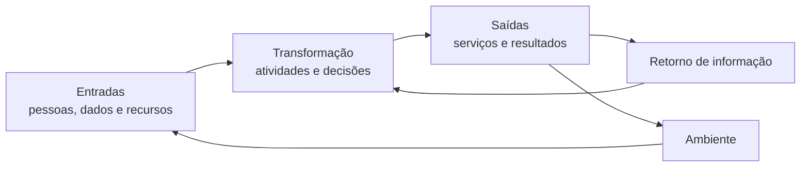

# Relações humanas, comportamento e visão sistêmica

<section class="lesson-goal">
  <h2>Nesta aula você vai aprender</h2>
  
por que pessoas não são peças de uma máquina e por que uma organização precisa ser entendida como partes ligadas ao ambiente.

</section>

  
Disciplina<strong>Administração Geral</strong>

  
Módulo<strong>2 • Teorias, funções e estruturas</strong>

  
Aula<strong>3 de 5</strong>

  
Tempo estimado<strong>Cerca de 90 minutos</strong>

## Objetivos da aula

Ao terminar, você deverá conseguir:

- explicar a contribuição das relações humanas;
- reconhecer grupos formais e informais;
- entender o foco do comportamento organizacional;
- analisar uma organização como sistema aberto;
- relacionar entrada, transformação, saída e retorno de informação.

### Por que isso cai na prova

Essas abordagens integram as teorias da Administração. Elas ampliam o olhar da aula anterior: tarefa, estrutura e regra continuam importantes, mas pessoas, grupos e ambiente também afetam o resultado.

### Como a FEPESE cobra

Não há amostra oficial validada suficiente para afirmar uma forma recorrente de cobrança neste assunto. Os exercícios são autorais e estão identificados como treino do conteúdo.

## Antes da teoria: o procedimento estava certo, mas o trabalho falhou

Uma unidade pública fictícia redesenhou um fluxo. As etapas ficaram claras. As responsabilidades foram registradas. Mesmo assim, a mudança não funcionou.

A equipe não foi ouvida. Pessoas experientes perceberam um erro, mas tiveram receio de avisar. Um grupo criou um modo informal de contornar a nova regra. A chefia interpretou o silêncio como concordância.

O desenho formal parecia bom. A relação entre as pessoas não foi compreendida.

!!! example "Exemplo"
    Uma reunião marcada no organograma não garante troca real de informação. Se ninguém se sente seguro para apontar um risco, a comunicação formal existe no papel, mas o problema continua escondido.

## Relações humanas: pessoas e grupos entram no centro

A explicação simples é esta: o resultado do trabalho depende também das relações sociais.

A abordagem das **Relações Humanas** chamou atenção para pessoas, grupos, comunicação, liderança e aspectos sociais do trabalho. Elton Mayo aparece com frequência associado a essa abordagem.

!!! note "Traduzindo"
    **Relações Humanas** é a abordagem que observa como convivência, grupos, liderança e atenção às pessoas influenciam o trabalho.

Ela ganhou força em reação a visões que davam atenção muito maior à tarefa e à estrutura formal.

### Organização formal e organização informal

A organização define cargos, unidades, chefias e procedimentos. Esse desenho é a **organização formal**.

Ao mesmo tempo, pessoas criam relações que não aparecem no organograma. Pedem ajuda, formam grupos, compartilham hábitos e exercem influência. Essa rede é a **organização informal**.

!!! note "Traduzindo"
    **Formal** é o que foi definido oficialmente. **Informal** é o que surge das relações reais entre as pessoas, sem depender de uma regra escrita.

O informal não é automaticamente ruim. Um grupo pode compartilhar conhecimento e resolver dúvidas rapidamente. Também pode resistir a uma mudança ou reforçar um comportamento inadequado.

!!! warning "Isso costuma confundir"
    Grupo informal não significa grupo ilegal. “Informal” apenas indica que a relação não nasceu do desenho oficial da organização.

### Liderança e comunicação

Dar uma ordem não garante compreensão. A forma de orientar, ouvir, explicar e acompanhar influencia o trabalho.

**Liderança** é a capacidade de influenciar pessoas em direção a um objetivo. Ela não se resume ao cargo de chefia.

**Comunicação** é o processo de produzir, transmitir, receber e compreender uma mensagem. Se a mensagem foi enviada, mas entendida de modo diferente, a comunicação não alcançou plenamente sua finalidade.

!!! question "Pausa para refletir"
    Uma chefia envia uma sigla sem explicação e a equipe executa outra tarefa. O problema terminou quando a mensagem foi enviada? Não. Era necessário verificar se o sentido foi compreendido.

## Comportamento organizacional: escolhas e ações no trabalho

As pessoas chegam ao trabalho com experiências, necessidades e formas diferentes de perceber uma situação. Elas atuam individualmente e em grupo.

O campo que estuda essas ações recebe o nome de **comportamento organizacional**.

!!! note "Traduzindo"
    **Comportamento organizacional** é o estudo de como pessoas e grupos agem dentro das organizações e de como isso afeta o trabalho.

Alguns temas ligados a esse olhar são:

- motivação;
- liderança;
- comunicação;
- conflito;
- tomada de decisão;
- cultura organizacional.

**Cultura organizacional** é o conjunto de valores, hábitos e significados compartilhados que influencia a forma de agir.

Não trate motivação como simples animação. Uma pessoa pode estar comprometida e ainda enfrentar falta de informação, recurso ou autoridade. Explicar todo problema como “falta de motivação” esconde outras causas.

!!! tip "Dica VX"
    Se o caso fala de influência, grupo, comunicação ou reação das pessoas, não tente resolvê-lo apenas com organograma e regra.

## Visão sistêmica: as partes formam um conjunto

Imagine agora que o setor de atendimento depende do cadastro, que depende da tecnologia, que depende da contratação e do orçamento.

Nenhuma parte trabalha completamente sozinha.

A abordagem que observa o conjunto e as relações recebe o nome de **visão sistêmica**.

Um **sistema** é um conjunto de partes relacionadas que atua para uma finalidade.

!!! note "Traduzindo"
    **Visão sistêmica** é olhar para o conjunto, para as ligações entre as partes e para a relação da organização com o ambiente.

### Sistema aberto

Uma organização recebe recursos e informações do ambiente. Realiza atividades. Entrega produtos, serviços, decisões e efeitos. Depois, recebe informações sobre o resultado.

Por manter trocas com o ambiente, ela é entendida como **sistema aberto**.

O ciclo básico pode ser representado assim:

### Entradas, transformação e saídas

- **Entradas:** aquilo que a organização recebe, como dados, pessoas e recursos.
- **Transformação:** o trabalho realizado sobre as entradas.
- **Saídas:** aquilo que a organização entrega.

O retorno de informação sobre a saída recebe o nome técnico de **feedback**.

!!! note "Traduzindo"
    **Feedback**, na visão de sistemas, é a informação que volta e ajuda a corrigir ou manter o funcionamento.

Exemplo: a unidade entrega um serviço. Os dados mostram aumento de erros. Essa informação volta à gestão, que revê uma etapa.

### O todo não é apenas a soma das partes

Duas equipes competentes podem produzir um resultado ruim se a passagem de informação entre elas falhar. O problema está na relação, não necessariamente na capacidade isolada de cada equipe.

Essa é uma contribuição importante da visão sistêmica: melhorar cada parte separadamente não garante o melhor resultado do conjunto.

## Compare os novos olhares

| Olhar | Pergunta principal | Sinais no caso |
|---|---|---|
| Relações Humanas | Como as relações e os grupos afetam o trabalho? | grupo informal, convivência, atenção, liderança |
| Comportamento organizacional | Como pessoas e grupos agem na organização? | motivação, percepção, conflito, cultura, decisão |
| Visão sistêmica | Como as partes e o ambiente se relacionam? | entradas, saídas, dependência, ambiente, feedback |

Esses olhares podem ser usados juntos. Uma mudança externa afeta o sistema. A organização redesenha o trabalho. Pessoas interpretam a mudança, conversam e reagem.

## Como isso pode aparecer na prova

Procure o dado que move o caso:

- relação social ou grupo informal;
- comportamento de pessoas e equipes;
- dependência entre partes;
- troca com o ambiente;
- retorno de informação usado para ajuste.

Uma alternativa que menciona “pessoas” não é automaticamente correta. Ela precisa explicar o problema apresentado.

## Revisão de 5 minutos da aula

Sem olhar, responda:

1. Qual é a diferença entre organização formal e informal?
2. O que estuda o comportamento organizacional?
3. Por que uma organização é um sistema aberto?
4. O que significa feedback?

??? question "Mostrar conferência"
    1. A formal é definida oficialmente; a informal surge das relações reais.
    2. Como pessoas e grupos agem e afetam o trabalho.
    3. Porque troca recursos, informações e resultados com o ambiente.
    4. Informação que retorna e permite ajustar ou manter o funcionamento.

## Resumo

- Relações Humanas: atenção às pessoas, grupos, liderança e comunicação.
- A organização formal está no desenho oficial; a informal nasce das relações.
- Comportamento organizacional estuda ações de pessoas e grupos no trabalho.
- Um sistema reúne partes relacionadas.
- A organização é aberta porque troca com o ambiente.
- Entradas passam por transformação e geram saídas; o feedback ajuda a ajustar.

## Exercícios de fixação

### Questão 1

Uma rede de ajuda criada espontaneamente entre colegas representa:

A. organização informal  
B. organograma oficial  
C. regra de competência  
D. portfólio de projetos  
E. sistema fechado

### Questão 2

Dados sobre erros retornam à equipe e levam à correção de uma etapa. Na visão sistêmica, esses dados funcionam como:

A. especialização  
B. unidade de comando  
C. feedback  
D. cargo formal  
E. divisão territorial

### Questão 3

Dois setores executam bem suas partes, mas a entrega final falha porque não trocam informação. A análise deve observar principalmente:

A. somente o rendimento individual  
B. a relação entre as partes  
C. apenas a quantidade de regras  
D. a eliminação do ambiente  
E. o nome dos cargos

??? success "Mostrar gabarito comentado"

    1. **A.** A rede surgiu das relações, sem ser criada pelo desenho oficial.
    2. **C.** A informação sobre a saída retorna e permite corrigir o funcionamento.
    3. **B.** Cada parte pode funcionar bem isoladamente e o conjunto falhar na ligação entre elas.

## Checklist

- [ ] Separo organização formal e informal.
- [ ] Explico liderança e comunicação sem depender do cargo.
- [ ] Entendo o foco do comportamento organizacional.
- [ ] Reconheço entradas, transformação, saídas e feedback.
- [ ] Analiso relações entre partes e ambiente.

## Flashcards

Use o [conjunto de flashcards do Módulo 2](modulo-02-flashcards.md) depois da primeira leitura.

## Referências

- TRIGUEIRO, Francisco Mirialdo Chaves; MARQUES, Neiva de Araújo. *Teorias da Administração I*. Programa Nacional de Formação em Administração Pública. Universidade Federal de Santa Catarina, 2014. Portal eduCAPES. Consulta em 3 de agosto de 2026.
- SAPE/SC; FEPESE. Edital nº 001/2026, Anexo 2, página 28. Versão consolidada.

**Última revisão:** pendente de revisão técnica, pedagógica e editorial.

## Continue estudando

[← Aula anterior](modulo-02-aula-02-abordagens-classica-cientifica-burocratica.md){ .md-button }

[Próxima aula →](modulo-02-aula-04-processo-administrativo.md){ .md-button .md-button--primary }
