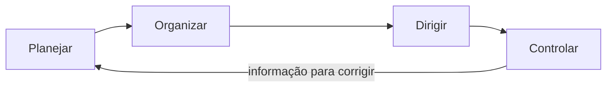

# Processo administrativo: planejar, organizar, dirigir e controlar

<section class="lesson-goal">
  <h2>Nesta aula você vai aprender</h2>
  
a transformar um objetivo em trabalho organizado e a acompanhar se o resultado está sendo alcançado.

</section>

  
Disciplina<strong>Administração Geral</strong>

  
Módulo<strong>2 • Teorias, funções e estruturas</strong>

  
Aula<strong>4 de 5</strong>

  
Tempo estimado<strong>Cerca de 90 minutos</strong>

## Objetivos da aula

Ao terminar, você deverá conseguir:

- explicar o sentido gerencial de processo administrativo;
- reconhecer planejamento, organização, direção e controle;
- separar as quatro funções em casos concretos;
- entender que elas formam um ciclo ligado;
- identificar a função predominante sem ignorar as demais.

### Por que isso cai na prova

O edital apresenta “processo administrativo” e, logo depois, “planejamento, organização, direção e controle”. A prova pode descrever uma ação e pedir a função correspondente.

### Como a FEPESE cobra

O projeto ainda não possui amostra oficial suficiente para afirmar um padrão da FEPESE neste ponto. Os exercícios são autorais. Eles treinam a classificação e a ligação entre as quatro funções.

## Antes da teoria: organizar uma campanha de atendimento

Uma Secretaria fictícia quer reduzir uma fila de atendimentos.

Primeiro, define o resultado esperado e o prazo. Depois, distribui pessoas, equipamentos e responsabilidades. A chefia orienta a equipe e resolve dúvidas. Durante o trabalho, compara o que aconteceu com o que estava previsto.

Quatro movimentos apareceram:

1. escolher o caminho;
2. preparar os meios;
3. conduzir as pessoas;
4. conferir e corrigir.

Esses movimentos formam o processo administrativo estudado nesta aula.

!!! example "Exemplo"
    Definir que a fila deve cair em 20% é planejamento. Separar equipes e horários é organização. Explicar prioridades e acompanhar pessoas é direção. Medir a fila e corrigir o plano é controle.

## Qual “processo administrativo” estamos estudando

A expressão pode aparecer em dois sentidos.

Em Direito Administrativo, ela pode indicar uma sequência formal de atos para produzir uma decisão pública.

Em Administração Geral, ela indica o conjunto de funções usadas para administrar uma organização.

O edital coloca a expressão ao lado de planejamento, organização, direção e controle. Portanto, aqui estudamos o sentido gerencial.

!!! warning "Isso costuma confundir"
    Nesta aula, processo administrativo não significa recurso, defesa ou procedimento jurídico. Significa o trabalho contínuo de planejar, organizar, dirigir e controlar.

O conjunto também é chamado de **processo de Administração** ou **ciclo administrativo**.

!!! note "Traduzindo"
    **Ciclo administrativo** é a ligação contínua entre escolher objetivos, organizar meios, conduzir o trabalho e conferir resultados.

## Planejamento: decidir antes de agir

Antes do termo, pense nesta pergunta: onde queremos chegar e como pretendemos chegar?

Responder a ela é **planejar**.

Planejamento define objetivos e escolhe ações para alcançá-los. Também considera prazos, recursos, riscos e formas de acompanhamento.

!!! note "Traduzindo"
    **Planejamento** é decidir antecipadamente o resultado desejado e o caminho para buscá-lo.

Planejar não é tentar prever o futuro com certeza. É preparar escolhas e revisar o caminho quando surgirem novas informações.

### Sinais de planejamento

- definir objetivo;
- analisar a situação;
- escolher uma ação;
- estabelecer prazo;
- prever recursos;
- preparar uma forma de medir.

!!! question "Pausa para refletir"
    A equipe escolhe o objetivo, mas ainda não distribuiu tarefas. Qual função predomina? Planejamento, porque o foco está no resultado e no caminho futuro.

## Organização: preparar pessoas e recursos

Depois de escolher o caminho, alguém precisa estruturar o trabalho.

Isso é **organizar**.

Organização distribui tarefas, responsabilidades, autoridade e recursos. Ela responde quem fará, com quais meios e como as partes se ligarão.

!!! note "Traduzindo"
    **Organização**, como função administrativa, é arrumar os meios necessários para executar o plano.

Não confunda a função “organização” com a instituição chamada organização. A mesma palavra pode indicar:

- a entidade ou grupo social;
- a função de preparar o trabalho.

### Sinais de organização

- dividir atividades;
- atribuir responsáveis;
- distribuir recursos;
- criar unidades;
- definir relações de autoridade;
- ajustar o fluxo de trabalho.

## Direção: conduzir o trabalho das pessoas

Recursos distribuídos não agem sozinhos. Pessoas precisam compreender o objetivo, trocar informações e coordenar esforços.

Essa função é **direção**.

Direção envolve liderança, comunicação, orientação, motivação e solução de conflitos ligados à execução.

!!! note "Traduzindo"
    **Direção** é conduzir pessoas durante a execução do trabalho.

Dar ordens é apenas uma parte possível. Uma boa direção também escuta, explica, acompanha e remove barreiras dentro da competência da chefia.

### Sinais de direção

- orientar a equipe;
- comunicar prioridades;
- liderar;
- apoiar a execução;
- lidar com conflito;
- acompanhar pessoas durante o trabalho.

## Controle: conferir e corrigir

O plano começou a ser executado. Como saber se está funcionando?

É preciso comparar o resultado observado com uma referência e agir quando houver diferença importante.

Essa função é **controle**.

!!! note "Traduzindo"
    **Controle** é acompanhar o que acontece, comparar com o esperado e corrigir o caminho quando necessário.

O controle costuma envolver:

1. definir um padrão ou resultado esperado;
2. medir o que aconteceu;
3. comparar esperado e realizado;
4. analisar a diferença;
5. corrigir ou manter a ação.

**Padrão**, aqui, é a referência usada para comparar. Pode ser uma meta, um prazo, uma regra de qualidade ou outro critério.

!!! warning "Isso costuma confundir"
    Controle não acontece apenas no fim. Acompanhar durante a execução permite corrigir antes que o problema cresça.

## As quatro funções formam um ciclo

Na prática, as funções se alimentam.

O controle produz informação para um novo planejamento. Uma dificuldade na direção pode exigir reorganização. Uma mudança de recursos pode obrigar a ajustar o plano.

!!! tip "Dica VX"
    Procure o verbo principal: **definir** aponta para planejamento; **distribuir**, para organização; **orientar**, para direção; **comparar e corrigir**, para controle.

## Função predominante

Um caso real pode conter as quatro funções. A questão costuma pedir a função que aparece com mais força.

Imagine que a chefia analisa os resultados, encontra diferença em relação à meta e muda uma etapa. Há decisão e organização, mas o movimento principal é comparar e corrigir. Portanto, predomina o controle.

## Revisão de 5 minutos da aula

Sem olhar, complete:

1. Planejar é...
2. Organizar é...
3. Dirigir é...
4. Controlar é...

??? question "Mostrar conferência"
    1. Definir objetivo e caminho.
    2. Distribuir tarefas, autoridade e recursos.
    3. Conduzir pessoas durante a execução.
    4. Comparar o resultado com a referência e corrigir quando necessário.

## Resumo

- Planejamento escolhe objetivo e caminho.
- Organização prepara pessoas, tarefas, autoridade e recursos.
- Direção conduz as pessoas durante a execução.
- Controle acompanha, compara e corrige.
- As funções são ligadas e contínuas.
- No caso, procure a função predominante pelo verbo principal.

## Exercícios de fixação

### Questão 1

Definir objetivos e escolher ações corresponde principalmente a:

A. direção  
B. controle  
C. planejamento  
D. organização informal  
E. especialização

### Questão 2

Uma gerente distribui tarefas e equipamentos entre equipes. Predomina a função de:

A. organização  
B. direção  
C. controle  
D. planejamento  
E. avaliação de impacto

### Questão 3

Comparar o resultado com a meta e corrigir uma etapa corresponde a:

A. autoridade  
B. controle  
C. especialização  
D. organização informal  
E. burocracia

## Gabarito comentado

1. **C.** Objetivo e escolha de ações são sinais de planejamento.
2. **A.** A gerente está preparando os meios para executar o plano.
3. **B.** Comparação e correção formam o núcleo do controle.

## Checklist

- [ ] Entendo o sentido gerencial de processo administrativo.
- [ ] Separo as quatro funções em exemplos.
- [ ] Reconheço o verbo principal de cada função.
- [ ] Sei que controle também ocorre durante a execução.
- [ ] Entendo por que o ciclo recomeça.

## Flashcards

Use o [conjunto de flashcards do Módulo 2](modulo-02-flashcards.md) depois da primeira leitura.

## Referências

- TRIGUEIRO, Francisco Mirialdo Chaves; MARQUES, Neiva de Araújo. *Teorias da Administração I*. Programa Nacional de Formação em Administração Pública. Universidade Federal de Santa Catarina, 2014. Portal eduCAPES. Consulta em 3 de agosto de 2026.
- SAPE/SC; FEPESE. Edital nº 001/2026, Anexo 2, página 28. Versão consolidada.

**Última revisão:** pendente de revisão técnica, pedagógica e editorial.

## Continue estudando

[← Aula anterior](modulo-02-aula-03-relacoes-humanas-comportamento-sistemas.md){ .md-button }

[Próxima aula →](modulo-02-aula-05-estruturas-centralizacao-descentralizacao.md){ .md-button .md-button--primary }

