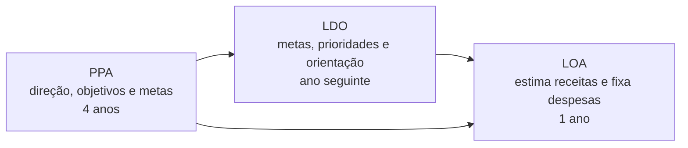

# Planejamento governamental e instrumentos públicos

<section class="lesson-goal">
  <h2>Nesta aula você vai aprender</h2>
  
como prioridades de governo se ligam a planos de médio prazo, orientações anuais e orçamento.

</section>

  
Disciplina<strong>Administração Geral</strong>

  
Módulo<strong>4 • Planejamento e resultados</strong>

  
Aula<strong>3 de 5</strong>

  
Tempo estimado<strong>Cerca de 90 minutos</strong>

## Objetivos da aula

Ao terminar, você deverá conseguir:

- explicar planejamento governamental;
- reconhecer por que o governo precisa coordenar áreas e períodos diferentes;
- entender a função geral de PPA, LDO e LOA;
- relacionar os três instrumentos;
- manter o limite entre Administração Geral e orçamento público.

### Por que isso cai na prova

O edital inclui planejamento governamental e instrumentos de planejamento da Administração Pública. PPA, LDO e LOA são os principais instrumentos constitucionais que ligam direção de governo e orçamento.

### Como a FEPESE cobra

O projeto ainda não possui amostra oficial suficiente para afirmar um padrão da FEPESE neste assunto. Os exercícios são autorais e limitam-se às funções gerais dos instrumentos.

## Antes da teoria: uma prioridade sem continuidade

Imagine que um governo decide ampliar a assistência técnica em regiões distantes.

A ação exige mais de um ano. Precisa de equipes, veículos, sistemas, contratos e acompanhamento. Se cada órgão planejar sozinho e o orçamento anual ignorar a prioridade, o objetivo ficará apenas no discurso.

O planejamento governamental precisa ligar tempo, áreas, programas e recursos.

!!! example "Exemplo"
    Uma política que exige quatro anos não pode depender apenas de uma lista anual de despesas. Ela precisa aparecer em um plano mais amplo e ser traduzida, ano a ano, em prioridades e recursos autorizados.

## O que é planejamento governamental

Primeiro, a ideia simples.

É o trabalho de definir prioridades públicas, organizar ações de governo e ligar essas escolhas aos recursos e ao acompanhamento.

!!! note "Traduzindo"
    **Planejamento governamental** é a organização das escolhas do governo para enfrentar problemas públicos e entregar resultados ao longo do tempo.

Ele é mais amplo que o plano estratégico de um órgão. Um governo precisa coordenar diferentes setores, regiões, políticas e organizações.

## Por que planejar no governo é complexo

Uma decisão pode afetar saúde, educação, agricultura, infraestrutura e finanças ao mesmo tempo. Além disso:

- recursos são limitados;
- necessidades competem por atenção;
- leis definem responsabilidades;
- programas atravessam exercícios anuais;
- mudanças sociais e econômicas alteram o cenário;
- diferentes órgãos precisam atuar juntos;
- a sociedade precisa acompanhar escolhas e resultados.

**Exercício**, no orçamento, é o período anual a que receitas e despesas se referem.

## Três instrumentos conectados

O artigo 165 da Constituição Federal apresenta três leis:

- Plano Plurianual;
- Lei de Diretrizes Orçamentárias;
- Lei Orçamentária Anual.

Elas são conhecidas pelas siglas PPA, LDO e LOA.

!!! note "Traduzindo"
    **PPA** dá direção para um período de quatro anos. **LDO** orienta a preparação e a execução do orçamento do ano seguinte. **LOA** estima receitas e fixa despesas para o ano.

## Plano Plurianual — PPA

O PPA organiza diretrizes, objetivos e metas para um período de quatro anos. Inclui despesas de capital e outras delas decorrentes, além de programas de duração continuada, conforme a Constituição.

Em linguagem simples, ele oferece uma direção de médio prazo para a atuação governamental.

**Diretriz** é uma orientação ampla que guia escolhas.

**Despesa de capital** é uma categoria orçamentária ligada, entre outros casos, a investimentos. A classificação detalhada pertence à disciplina de Administração Financeira e Orçamentária.

!!! note "Traduzindo"
    O PPA responde: “Quais direções, objetivos e metas orientarão o governo ao longo de quatro anos?”.

## Lei de Diretrizes Orçamentárias — LDO

A LDO faz a ligação entre o planejamento mais amplo e o orçamento anual.

Ela apresenta metas e prioridades para o exercício seguinte e orienta a elaboração da LOA, além de outras funções definidas pela Constituição e pelas normas financeiras.

!!! note "Traduzindo"
    A LDO responde: “Quais prioridades e regras orientarão o orçamento do próximo ano?”.

Chamar a LDO de ponte ajuda a lembrar sua posição entre PPA e LOA. Porém, a lei possui conteúdo próprio. Ela não é apenas uma página de ligação.

## Lei Orçamentária Anual — LOA

A LOA estima as receitas e fixa as despesas para um exercício.

**Estimar receita** é calcular quanto se espera arrecadar. **Fixar despesa** é definir a autorização orçamentária para gastar dentro das regras aplicáveis.

!!! note "Traduzindo"
    A LOA responde: “Que receitas são esperadas e que despesas estão autorizadas para o ano?”.

A LOA deve ser compatível com o PPA e a LDO. Ela transforma escolhas de planejamento em previsão e autorização orçamentária anual.

## A ligação entre PPA, LDO e LOA

!!! tip "Dica VX"
    Use três verbos: **PPA orienta o período**, **LDO faz a ponte anual**, **LOA prevê e autoriza no ano**.

## Plano não é garantia automática de resultado

Inserir um objetivo no plano não produz a entrega sozinho. É preciso:

- definir ações;
- atribuir responsáveis;
- disponibilizar recursos conforme as regras;
- executar;
- monitorar;
- avaliar;
- corrigir.

O planejamento também precisa manter coerência entre os instrumentos.

**Coerência** significa que escolhas e ações não se contradizem e apontam para a mesma direção.

!!! warning "Isso costuma confundir"
    PPA, LDO e LOA são ligados, mas não são iguais. O PPA não substitui o orçamento anual. A LOA não deve criar uma direção desconectada do PPA e da LDO.

## Planejamento institucional e governamental

O plano estratégico de um órgão organiza sua atuação institucional. O planejamento governamental coordena prioridades e ações mais amplas do governo.

Eles precisam conversar. Um órgão não deve criar objetivos estratégicos incompatíveis com suas competências ou com as direções públicas aplicáveis.

## Limite desta aula

Aqui, você precisa reconhecer a função e a ligação dos instrumentos.

Na disciplina de Administração Financeira e Orçamentária serão aprofundados:

- princípios e ciclo orçamentário;
- receitas e despesas;
- execução;
- créditos adicionais;
- regras fiscais.

!!! question "Pausa para refletir"
    Um projeto aparece como prioridade ampla, mas não recebe qualquer autorização orçamentária no ano. A inclusão no plano basta para gastar? Não. Planejamento e orçamento precisam estar ligados, e o gasto depende da autorização e das demais regras aplicáveis.

## Revisão de 5 minutos da aula

Sem olhar, responda:

1. O que é planejamento governamental?
2. Qual é a função geral do PPA?
3. Por que a LDO é chamada de ponte?
4. O que a LOA faz com receitas e despesas?

??? question "Mostrar conferência"
    1. Organiza escolhas do governo para enfrentar problemas e entregar resultados ao longo do tempo.
    2. Define diretrizes, objetivos e metas para quatro anos.
    3. Porque orienta a ligação entre o planejamento amplo e o orçamento anual.
    4. Estima receitas e fixa despesas para o exercício.

## Resumo

- Planejamento governamental liga prioridades, ações, tempo e recursos.
- PPA define diretrizes, objetivos e metas para quatro anos.
- LDO apresenta metas e prioridades e orienta o orçamento seguinte.
- LOA estima receitas e fixa despesas para o ano.
- Os instrumentos precisam ser compatíveis.
- Planejar não substitui executar, monitorar e avaliar.
- O aprofundamento orçamentário pertence à disciplina de AFO.

## Exercícios de fixação

### Questão 1

O instrumento que define diretrizes, objetivos e metas para quatro anos é:

A. LDO  
B. LOA  
C. PPA  
D. relatório gerencial  
E. organograma

### Questão 2

A lei que orienta o orçamento do exercício seguinte e apresenta metas e prioridades é:

A. LDO  
B. PPA  
C. LOA  
D. missão  
E. mapa estratégico

### Questão 3

A LOA:

A. define a missão permanente do órgão  
B. estima receitas e fixa despesas para o ano  
C. substitui o PPA  
D. possui vigência obrigatória de quatro anos  
E. elimina a necessidade de LDO

## Gabarito comentado

1. **C.** Essa é a função constitucional geral do PPA.
2. **A.** A LDO liga o planejamento mais amplo ao orçamento anual.
3. **B.** A LOA trabalha com receitas estimadas e despesas fixadas para o exercício.

## Checklist

- [ ] Explico planejamento governamental.
- [ ] Lembro a função geral de PPA, LDO e LOA.
- [ ] Consigo organizar os três instrumentos.
- [ ] Entendo compatibilidade entre planejamento e orçamento.
- [ ] Sei que plano não autoriza sozinho qualquer gasto.
- [ ] Mantenho o limite com a disciplina de AFO.

## Flashcards

Os cartões serão reunidos no [conjunto de flashcards do Módulo 4](modulo-04-flashcards.md).

## Referências

- BRASIL. Constituição Federal de 1988, artigo 165. Texto oficial consolidado. Consulta em 3 de agosto de 2026.
- BRASIL. Ministério do Planejamento e Orçamento. Plano Plurianual. Portal oficial. Consulta em 3 de agosto de 2026.
- BRASIL. Secretaria do Tesouro Nacional. Planejamento fiscal: PPA, LDO e LOA. Portal oficial. Consulta em 3 de agosto de 2026.
- SAPE/SC; FEPESE. Edital nº 001/2026, Anexo 2, página 28.

**Última revisão:** pendente de revisão técnica, pedagógica e editorial.

## Continue estudando

[← Aula anterior](modulo-04-aula-02-niveis-planejamento.md){ .md-button }

[Próxima aula →](modulo-04-aula-04-gestao-estrategica-resultados.md){ .md-button .md-button--primary }

