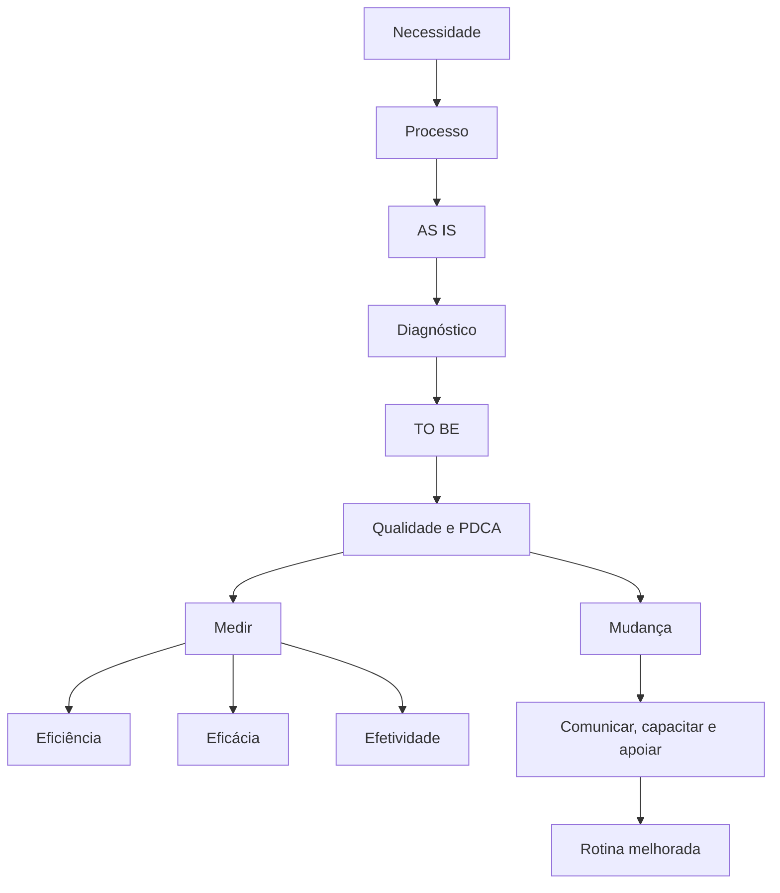

# Revisão de 5 minutos do Módulo 5

<section class="lesson-goal"><h2>Em cinco minutos você vai lembrar</h2>
as comparações que resolvem a maior parte dos casos do módulo.
</section>

## Responda sem olhar

1. O que entra e o que sai de um processo?
2. Qual é a diferença entre unidade e processo?
3. O que AS IS e TO BE representam?
4. Qual é a diferença entre sintoma e causa?
5. Qual é a ordem do PDCA?
6. Eficiência, eficácia e efetividade perguntam o quê?
7. Por que alguém pode resistir a uma mudança?
8. O que mostra que a mudança entrou na rotina?

??? question "Conferir respostas"
    1. Entradas alimentam o trabalho; saídas são as entregas.
    2. Unidade é parte da estrutura; processo é fluxo.
    3. Situação atual e situação futura desejada.
    4. Sintoma aparece; causa produz o problema.
    5. Planejar, executar, verificar e agir.
    6. Recursos, meta e efeito na realidade.
    7. Medo, falta de informação, habilidade, apoio ou problema real.
    8. Uso da nova prática, abandono da antiga e resultados acompanhados.

## Mapa mental

!!! note "Pausa"
    Feche a página e explique o mapa em voz alta. Se travar em um ramo, volte somente à aula correspondente.

## Checklist rápido

- [ ] Expliquei o mapa sem consultar.
- [ ] Dei exemplo para as três medidas.
- [ ] Lembrei que melhora local pode piorar o todo.
- [ ] Sei qual aula abrir quando erro.

[← Resumo](modulo-05-resumo.md){ .md-button }

[Treinar com flashcards →](modulo-05-flashcards.md){ .md-button .md-button--primary }
