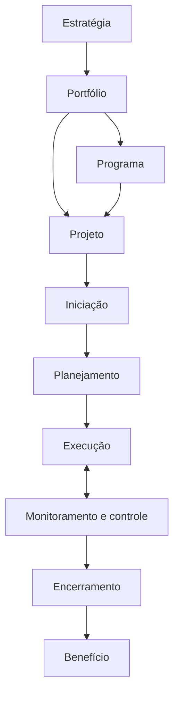

# Revisão de 5 minutos do Módulo 6

<section class="lesson-goal"><h2>Em cinco minutos você vai lembrar</h2>
o caminho do projeto e as comparações que mais confundem.
</section>

## Responda sem olhar

1. Projeto e processo diferem em quê?
2. Programa e portfólio diferem em quê?
3. Quais são as fases gerais do projeto?
4. O que é escopo?
5. Risco e problema são iguais?
6. O que é linha de base?
7. Entrega e benefício são iguais?
8. Por que priorizar exige escolha?

??? question "Conferir"
    1. Projeto é temporário e único; processo é recorrente. 2. Programa coordena projetos relacionados; portfólio reúne iniciativas para a estratégia. 3. Iniciação, planejamento, execução, monitoramento e controle, encerramento. 4. Fronteira do trabalho. 5. Não; problema já ocorreu. 6. Referência aprovada. 7. Não; benefício é melhora gerada. 8. Os recursos são limitados.

## Mapa mental

- [ ] Expliquei o mapa em voz alta.
- [ ] Criei um exemplo de cada conceito.
- [ ] Sei qual aula resolve meu erro.

[← Resumo](modulo-06-resumo.md){ .md-button }

[Treinar flashcards →](modulo-06-flashcards.md){ .md-button .md-button--primary }
