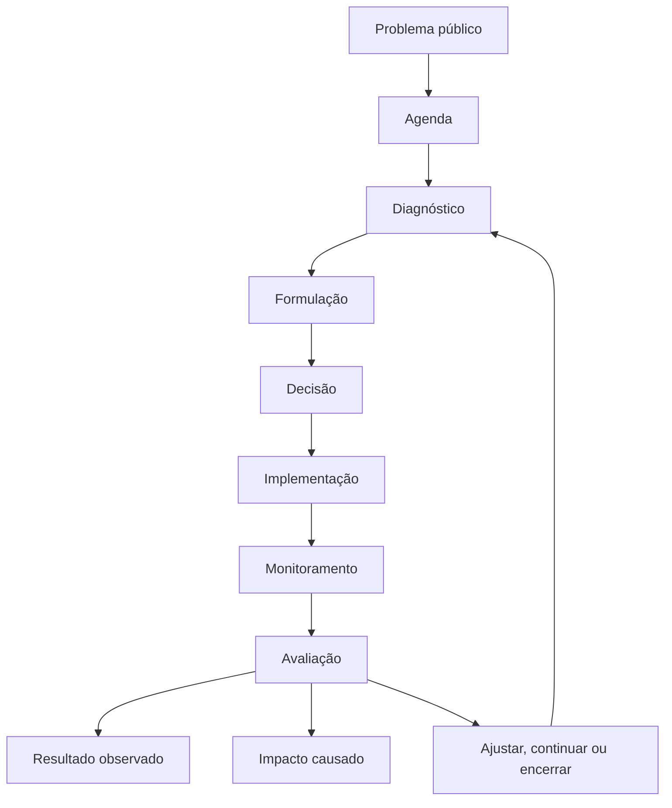

# Revisão de 5 minutos do Módulo 7

<section class="lesson-goal"><h2>Em cinco minutos você vai lembrar</h2>
as perguntas que organizam uma política pública inteira.
</section>

## Responda sem olhar

1. Qual problema merece resposta?
2. O tema entrou na agenda?
3. Quais causas e públicos foram identificados?
4. Quais alternativas foram comparadas?
5. Qual instrumento combina com a causa?
6. A execução chegou ao público?
7. O indicador mudou?
8. A política causou a mudança?

??? question "Conferir os conceitos"
    1–2: problema e agenda. 3: diagnóstico. 4: formulação. 5: desenho. 6: implementação. 7: resultados. 8: impacto.

## Mapa mental

- [ ] Expliquei o mapa sem consultar.
- [ ] Dei um exemplo de instrumento.
- [ ] Separei resultado e impacto.
- [ ] Sei qual aula abrir quando erro.

[← Resumo](modulo-07-resumo.md){ .md-button }

[Treinar flashcards →](modulo-07-flashcards.md){ .md-button .md-button--primary }
