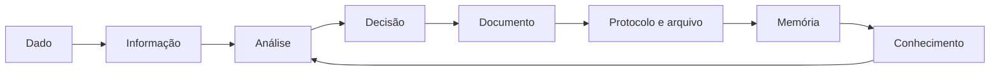

# Revisão de 5 minutos do Módulo 8

<section class="lesson-goal"><h2>Em cinco minutos você vai lembrar</h2>
como informação, documento e conhecimento se ligam.
</section>

## Responda sem olhar

1. Vazio e zero são iguais?
2. Média e mediana reagem igual a valor extremo?
3. Painel e relatório cumprem a mesma função?
4. Evidência elimina a responsabilidade de decidir?
5. Quais são as fases documentais?
6. O que temporalidade e destinação indicam?
7. Parecer e decisão são iguais?
8. Conhecimento tácito e explícito diferem em quê?

??? question "Conferir"
    1. Não. 2. Não; a média muda mais. 3. Não; painel acompanha e relatório explica. 4. Não. 5. Corrente, intermediária e permanente. 6. Prazo e destino. 7. Em regra, não. 8. Um está ligado à experiência; o outro está registrado.

## Mapa mental

- [ ] Expliquei o mapa.
- [ ] Dei exemplo de cada tipo de documento.
- [ ] Separei produto e resultado do conhecimento.
- [ ] Sei qual aula abrir quando erro.

[← Resumo](modulo-08-resumo.md){ .md-button }

[Treinar flashcards →](modulo-08-flashcards.md){ .md-button .md-button--primary }
