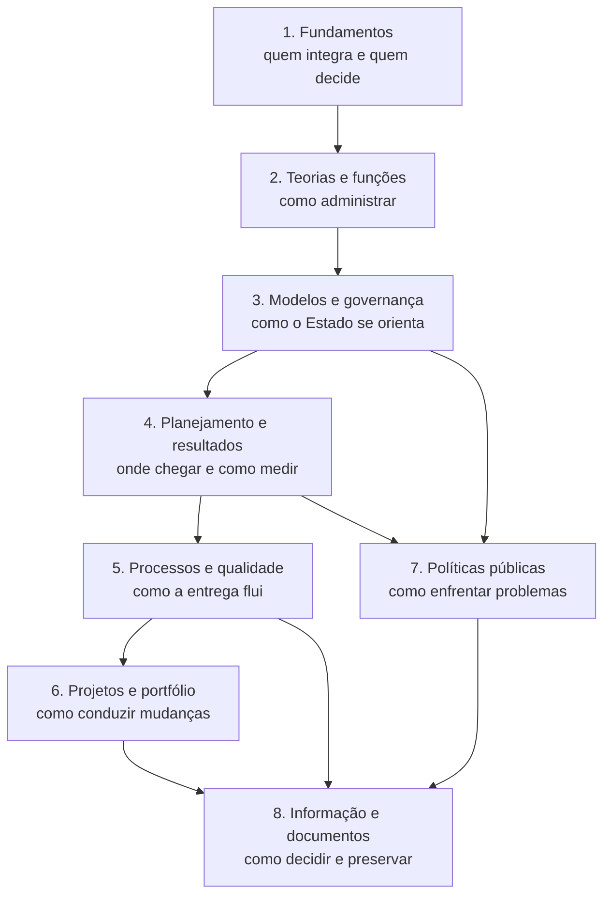

# Aula 1 — Revisão geral e mapas mentais

<section class="lesson-goal"><h2>Nesta aula você vai conseguir</h2><p>reconstruir a disciplina em oito blocos e localizar rapidamente a origem de cada dúvida.</p></section>

<div class="lesson-meta-grid"><div class="lesson-meta-card"><span>Disciplina</span><strong>Administração Geral</strong></div><div class="lesson-meta-card"><span>Módulo</span><strong>9 • Revisão final</strong></div><div class="lesson-meta-card"><span>Aula</span><strong>1 de 4</strong></div><div class="lesson-meta-card"><span>Tempo</span><strong>90 minutos</strong></div></div>

## Primeiro, tente lembrar

Pegue uma folha. Escreva os nomes dos oito módulos anteriores. Ao lado de cada um, anote três ideias sem consultar.

Só depois compare com o mapa abaixo.

!!! example "Exemplo"
    Se você escreveu “órgão, entidade e competência” no Módulo 1, recuperou o centro do bloco. Agora confira as relações.

!!! note "Importante"
    O mapa ajuda a localizar conceitos. Ele não substitui a explicação da aula quando ainda existe dúvida.

## A disciplina inteira



## Mapa 1 — Fundamentos

```text
LIMPE → regime público → Direta/Indireta → SC → competência
```

Perguntas-chave:

- a ação respeita legalidade, impessoalidade, moralidade, publicidade e eficiência?
- é órgão ou entidade?
- há hierarquia ou apenas vinculação?
- quem recebeu competência para agir?

## Mapa 2 — Organização e modelos

```text
teorias → planejar/organizar/dirigir/controlar → estruturas → modelos públicos → governança
```

Perguntas-chave:

- qual problema cada teoria tentou resolver?
- a frase fala de rumo, estrutura, pessoas, sistema ou resultado?
- governança direciona e monitora; gestão executa.

## Mapa 3 — Estratégia e execução

```text
missão → visão → diagnóstico → objetivo → iniciativa → meta → indicador → acompanhamento
```

O plano chega à entrega por processos e projetos. Eficiência olha recursos. Eficácia olha metas. Efetividade olha mudança real.

## Mapa 4 — Política pública

```text
problema → agenda → diagnóstico → formulação → decisão → implementação → avaliação
```

Resultado é mudança observada. Impacto é mudança causada. Contrafactual é a situação estimada sem a política.

## Mapa 5 — Informação e memória

```text
dado → informação → análise → decisão → documento → arquivo → conhecimento
```

Vazio não é zero. Painel sinaliza. Relatório explica. Protocolo rastreia. Arquivo preserva contexto. Conhecimento precisa ser usado.

## Ligações que merecem atenção

- governança direciona; planejamento transforma direção em objetivos;
- projeto cria entrega; processo sustenta trabalho recorrente;
- indicador acompanha projeto, processo ou política;
- avaliação pode examinar desenho, execução, resultado ou impacto;
- documento registra a decisão; gestão do conhecimento aproveita o aprendizado.

!!! warning "Isso costuma confundir"
    A mesma palavra pode aparecer em contextos diferentes. Linha de base pode ser valor inicial de indicador ou referência aprovada de um projeto. Leia o caso.

## Faça a sua matriz de erros

| Tema | Acertei sem dúvida | Acertei com dúvida | Errei | Aula de retorno |
|---|:---:|:---:|:---:|---|
| Fundamentos | [ ] | [ ] | [ ] | ____ |
| Teorias e funções | [ ] | [ ] | [ ] | ____ |
| Modelos e governança | [ ] | [ ] | [ ] | ____ |
| Planejamento | [ ] | [ ] | [ ] | ____ |
| Processos e qualidade | [ ] | [ ] | [ ] | ____ |
| Projetos | [ ] | [ ] | [ ] | ____ |
| Políticas públicas | [ ] | [ ] | [ ] | ____ |
| Informação e documentos | [ ] | [ ] | [ ] | ____ |

!!! tip "Dica VX"
    Acerto por chute entra na coluna “dúvida”. A letra certa não prova domínio.

## Pausa final

Escolha duas ligações do mapa e explique em voz alta. Se você consegue ensinar com um exemplo, o caminho está firme.

## Resumo

- A disciplina segue da base à decisão e à memória.
- Mapa mostra relações, não substitui aula.
- Erro precisa levar ao ponto exato de retorno.
- Chute deve ser revisado.
- Revisão final prioriza fraquezas reais.

## Checklist

- [ ] Reconstruí os oito módulos.
- [ ] Expliquei as ligações principais.
- [ ] Preenchi minha matriz.
- [ ] Marquei chutes como dúvida.
- [ ] Escolhi três pontos para revisar.

## Exercícios de fixação

### 1. Qual ligação une planejamento e processo?
### 2. Qual ligação une política e dados?
### 3. Qual ligação une documento e conhecimento?

??? question "Ver gabarito comentado"
    **1.** Objetivos e iniciativas viram fluxos de trabalho. **2.** Dados permitem acompanhar e avaliar a política. **3.** Documentos preservam parte do conhecimento produzido.

## Flashcards da aula

??? question "Qual é o caminho da estratégia?"
    Missão, visão, diagnóstico, objetivo, iniciativa, meta, indicador e acompanhamento.
??? question "Projeto e processo se ligam como?"
    Projeto cria mudança; processo sustenta operação recorrente.
??? question "Resultado e impacto diferem como?"
    Resultado é observado; impacto é atribuído à ação.
??? question "Por que registrar decisão?"
    Para provar, revisar, controlar e aprender.

[← Apresentação](modulo-09-index.md){ .md-button }

[Próxima aula →](modulo-09-aula-02-flashcards-fepese.md){ .md-button .md-button--primary }
