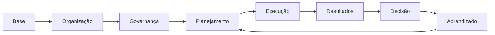

# Revisão final de 5 minutos

<section class="lesson-goal"><h2>Em cinco minutos você vai testar</h2>
se consegue percorrer a disciplina sem ajuda.
</section>

## Complete em voz alta

1. Administração Direta e Indireta...
2. Planejar, organizar, dirigir e controlar...
3. Patrimonial, burocrático, gerencial e societal...
4. Missão, visão, objetivo, meta e indicador...
5. AS IS, TO BE, PDCA e desempenho...
6. Projeto, programa, processo e portfólio...
7. Agenda, formulação, implementação e impacto...
8. Dado, informação, documento e conhecimento...

??? question "Conferir o foco"
    1. estrutura e personalidade. 2. funções administrativas. 3. modelos públicos. 4. planejamento. 5. melhoria de processos. 6. formas de organizar iniciativas. 7. ciclo da política. 8. decisão, prova e aprendizado.

- [ ] Completei os oito itens.
- [ ] Expliquei o mapa.
- [ ] Identifiquei meu ponto mais fraco.
- [ ] Sei o próximo passo.

[← Resumo final](modulo-09-resumo.md){ .md-button }

[Treinar os 80 flashcards →](modulo-09-flashcards.md){ .md-button .md-button--primary }
