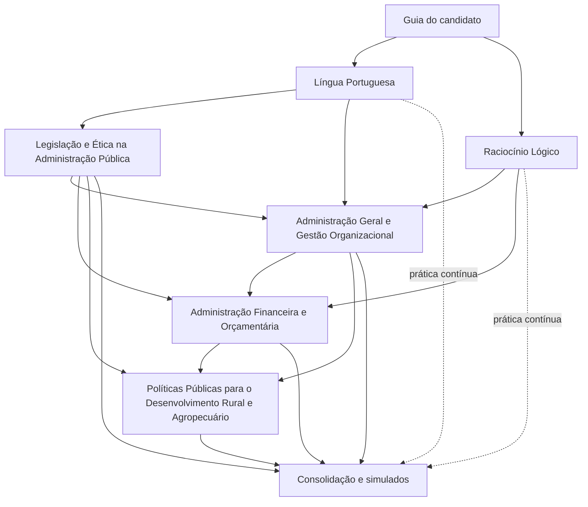

# Mapa pedagógico do Curso SAPE/SC 2026

## Escopo e fonte

Este mapa cobre o programa do cargo de **Analista Técnico Administrativo II** do Concurso Público SAPE/SC, Edital 001/2026, consolidado com os Termos de Retificação nº 01, nº 02 e nº 03. A fonte normativa e a transcrição integral do programa estão em [`EDITAL.md`](../EDITAL.md).

O mapa define módulos e títulos de aulas; ele **não contém aulas**. A divisão pedagógica não altera nem amplia o conteúdo oficial. Tópicos próximos foram ordenados para construir pré-requisitos antes de aplicações integradas.

## Critérios de planejamento

- A prova tem 50 questões de 0,20 ponto: 8 de Língua Portuguesa, 7 de Raciocínio Lógico e 35 de Conhecimentos Específicos.
- Os percentuais oficiais são 16%, 14% e 70%, respectivamente.
- O edital não distribui as 35 questões entre os quatro blocos específicos. As participações individuais sugeridas abaixo são **estimativas editoriais para alocação de tempo**, não pesos da prova.
- O tempo estimado inclui leitura orientada, recuperação sem consulta e prática inicial. Revisões espaçadas e simulados acrescentam aproximadamente 25% à carga líquida.
- Uma aula planejada corresponde, em média, a 90 minutos de estudo inicial. Atos extensos podem exigir mais de um bloco na execução editorial.
- Dificuldade usa escala de 1 a 5: 1 representa baixa complexidade relativa e 5, alta complexidade, volume ou volatilidade normativa.

## Visão executiva

| Ordem | Disciplina | Peso oficial | Prioridade editorial aproximada | Módulos | Aulas | Estudo inicial | Dificuldade |
|---:|---|---:|---:|---:|---:|---:|---:|
| 1 | Língua Portuguesa | 16% | 16% | 6 | 28 | 42 h | 3/5 |
| 2 | Raciocínio Lógico | 14% | 14% | 6 | 18 | 27 h | 3/5 |
| 3 | Legislação e Ética na Administração Pública | Parte dos 70% | 18%* | 9 | 27 | 40 h 30 min | 4/5 |
| 4 | Administração Geral e Gestão Organizacional | Parte dos 70% | 20%* | 9 | 42 | 63 h | 4/5 |
| 5 | Administração Financeira e Orçamentária | Parte dos 70% | 14%* | 7 | 27 | 40 h 30 min | 4/5 |
| 6 | Políticas Públicas para o Desenvolvimento Rural e Agropecuário | Parte dos 70% | 18%* | 8 | 35 | 52 h 30 min | 5/5 |
|  | **Total** | **100%** | **100%** | **45** | **177** | **265 h 30 min** |  |

\* Estimativa de planejamento. O edital informa apenas o peso conjunto de 70% para Conhecimentos Específicos.

Com revisões e simulados, a carga global projetada é de aproximadamente **332 horas líquidas**. Essa carga representa cobertura integral, não um cronograma obrigatório para todos os estudantes.

## Ordem pedagógica e dependências

1. **Língua Portuguesa** começa primeiro e permanece ativa durante todo o curso, pois interpretação e precisão de leitura afetam todas as áreas.
2. **Raciocínio Lógico** começa em paralelo e fornece base quantitativa para indicadores, estatística, orçamento e análise de dados.
3. **Legislação e Ética** estabelece Constituição, regime jurídico e princípios que sustentam Administração Pública, responsabilização e licitações.
4. **Administração Geral e Gestão Organizacional** usa os fundamentos jurídicos e prepara planejamento governamental, políticas públicas, indicadores e processos.
5. **Administração Financeira e Orçamentária** aproveita proporcionalidade, leitura de dados, planejamento público e noções de Administração.
6. **Políticas Públicas para o Desenvolvimento Rural e Agropecuário** integra competências institucionais, políticas públicas e atos específicos da SAPE/SC; deve começar após os fundamentos, mas avançar em paralelo por seu volume.

Não se recomenda concluir uma disciplina inteira antes de iniciar a seguinte. A ordem indica a abertura dos ciclos; depois das bases, as seis frentes devem ser intercaladas conforme prioridade e desempenho.

## 1. Língua Portuguesa

**Objetivo:** desenvolver leitura precisa, análise linguística e domínio das convenções cobradas, com capacidade de interpretar gêneros diversos, reconhecer relações de sentido e avaliar estruturas morfossintáticas e comunicações oficiais.

- **Importância oficial:** 8 questões, 1,60 ponto, 16% da prova.
- **Ordem ideal:** 1ª; estudo contínuo e transversal.
- **Dependências:** nenhuma. Sustenta a compreensão de enunciados e textos normativos de todas as disciplinas.
- **Quantidade sugerida:** 6 módulos e 28 aulas.
- **Tempo estimado:** 42 horas de estudo inicial.
- **Dificuldade:** 3/5.

### Módulo 1 — Compreensão, gêneros e tipologia textual

1. Compreensão e interpretação de textos de diferentes gêneros
2. Estratégias de leitura, inferência e informação explícita
3. Tipologia textual
4. Níveis de linguagem e variação linguística
5. Coesão e coerência textual

### Módulo 2 — Semântica e recursos expressivos

1. Sentido próprio: denotação
2. Sentido figurado: conotação
3. Figuras de linguagem

### Módulo 3 — Fonética e ortografia

1. Sílabas e tonicidade
2. Encontros vocálicos: ditongos e tritongos
3. Encontros consonantais e dígrafos
4. Ortografia oficial e acentuação gráfica
5. Emprego do hífen, homônimos e parônimos

### Módulo 4 — Morfologia e formação vocabular

1. Classes de palavras: nomes e determinantes
2. Classes de palavras: verbos, advérbios e conectivos
3. Formação de palavras por derivação e composição
4. Vocábulos simples e compostos
5. Flexão nominal e verbal
6. Emprego de pronomes

### Módulo 5 — Sintaxe e pontuação

1. Termos da oração e funções sintáticas
2. Período simples e funções sintáticas de substantivos, adjetivos e pronomes
3. Período composto e classificação de orações
4. Reestruturação de frases
5. Concordância nominal e verbal
6. Regência nominal e verbal e crase
7. Pontuação

### Módulo 6 — Redação oficial

1. Aspectos gerais da redação oficial
2. Comunicações oficiais conforme o Manual de Redação da Presidência da República vigente

## 2. Raciocínio Lógico

**Objetivo:** consolidar operações e modelos quantitativos necessários para resolver problemas, reconhecer padrões e interpretar dados, tabelas, gráficos, estatísticas e probabilidades elementares.

- **Importância oficial:** 7 questões, 1,40 ponto, 14% da prova.
- **Ordem ideal:** 2ª; iniciar em paralelo com Língua Portuguesa.
- **Dependências:** nenhuma formal; leitura cuidadosa de Português melhora a tradução de problemas.
- **Quantidade sugerida:** 6 módulos e 18 aulas.
- **Tempo estimado:** 27 horas de estudo inicial.
- **Dificuldade:** 3/5.

### Módulo 1 — Números reais e operações

1. Conjuntos numéricos e números reais
2. Adição, subtração, multiplicação e divisão
3. Potenciação e radiciação

### Módulo 2 — Razões, proporções e porcentagem

1. Razões e proporções
2. Regra de três simples
3. Regra de três composta
4. Porcentagem e noções de proporcionalidade

### Módulo 3 — Conjuntos e equações

1. Conjuntos e representação
2. Operações elementares com conjuntos
3. Equações do primeiro grau

### Módulo 4 — Sequências e padrões

1. Sequências lógicas
2. Identificação e generalização de padrões

### Módulo 5 — Tabelas, gráficos e estatística descritiva

1. Leitura, interpretação e análise de tabelas
2. Leitura, interpretação e análise de gráficos
3. Médias e medidas simples de variabilidade

### Módulo 6 — Probabilidade e situações-problema

1. Noções elementares de probabilidade
2. Problemas de raciocínio quantitativo
3. Problemas integrados de raciocínio lógico

## 3. Legislação e Ética na Administração Pública

**Objetivo:** dominar os fundamentos constitucionais e legais da atuação administrativa, os deveres e responsabilidades do agente público, os regimes estadual e disciplinar e as regras de transparência, dados, improbidade, licitações e contratos.

- **Importância oficial:** integra as 35 questões e os 70% de Conhecimentos Específicos; o edital não informa peso individual.
- **Prioridade editorial aproximada:** 18% da prova total, sem valor oficial.
- **Ordem ideal:** 3ª.
- **Dependências:** Língua Portuguesa para leitura normativa. Seus fundamentos antecedem Administração Pública, AFO e políticas da SAPE/SC.
- **Quantidade sugerida:** 9 módulos e 27 aulas.
- **Tempo estimado:** 40 horas e 30 minutos de estudo inicial.
- **Dificuldade:** 4/5.

### Módulo 1 — Fundamentos constitucionais

1. Constituição Federal: artigos 1º a 4º
2. Constituição Federal: artigos 5º a 11
3. Constituição Federal: artigos 12 a 16

### Módulo 2 — Administração Pública na Constituição

1. Constituição Federal: artigo 37
2. Constituição Federal: artigos 38 a 41

### Módulo 3 — Ética, integridade e responsabilização penal

1. Ética, integridade e conduta no serviço público
2. Código Penal: crimes dos artigos 312 a 319-A
3. Código Penal: crimes e disposições dos artigos 320 a 327

### Módulo 4 — Estatuto dos Servidores de Santa Catarina

1. Lei Estadual nº 6.745/1985: estrutura, provimento e vida funcional
2. Lei Estadual nº 6.745/1985: direitos e vantagens
3. Lei Estadual nº 6.745/1985: deveres, proibições e responsabilidades
4. Lei Estadual nº 6.745/1985: demais disposições cobradas

### Módulo 5 — Estatuto Jurídico Disciplinar estadual

1. Lei Complementar Estadual nº 491/2010: princípios, sujeitos e competência
2. Lei Complementar Estadual nº 491/2010: procedimento disciplinar
3. Lei Complementar Estadual nº 491/2010: sanções, recursos e disposições finais

### Módulo 6 — Acesso à informação

1. Lei nº 12.527/2011: fundamentos, transparência e acesso
2. Lei nº 12.527/2011: procedimento, restrições e responsabilidades

### Módulo 7 — Proteção de dados pessoais

1. Lei nº 13.709/2018: fundamentos, conceitos e princípios
2. Lei nº 13.709/2018: tratamento pelo poder público, direitos e responsabilidades

### Módulo 8 — Improbidade administrativa

1. Lei nº 8.429/1992: sujeitos, dolo e atos de improbidade
2. Lei nº 8.429/1992: sanções e prescrição
3. Lei nº 8.429/1992: processo e alterações vigentes na data de corte

### Módulo 9 — Licitações e contratos administrativos

1. Lei nº 14.133/2021: âmbito, princípios, agentes e governança
2. Lei nº 14.133/2021: fase preparatória e modalidades
3. Lei nº 14.133/2021: julgamento, habilitação, contratação direta e procedimentos auxiliares
4. Lei nº 14.133/2021: contratos administrativos
5. Lei nº 14.133/2021: controle, infrações, sanções e disposições finais

## 4. Administração Geral e Gestão Organizacional

**Objetivo:** compreender organizações públicas e seus modelos de gestão, planejar e avaliar estratégias, programas, projetos, processos e políticas, e usar informação, documentos e indicadores para apoiar decisões e resultados.

- **Importância oficial:** integra as 35 questões e os 70% de Conhecimentos Específicos; o edital não informa peso individual.
- **Prioridade editorial aproximada:** 20% da prova total, sem valor oficial.
- **Ordem ideal:** 4ª.
- **Dependências:** fundamentos constitucionais e princípios da Administração Pública; Raciocínio Lógico para indicadores e estatística.
- **Quantidade sugerida:** 9 módulos e 42 aulas.
- **Tempo estimado:** 63 horas de estudo inicial.
- **Dificuldade:** 4/5.

### Módulo 1 — Fundamentos da Administração Pública

1. Princípios da Administração Pública
2. Organização administrativa e regime jurídico-administrativo
3. Administração direta e indireta
4. Administração Pública do Estado de Santa Catarina
5. Competências dos órgãos e entidades públicas

### Módulo 2 — Teorias e processo administrativo

1. Teorias da administração
2. Processo administrativo: planejamento e organização
3. Processo administrativo: direção e controle
4. Estruturas organizacionais
5. Centralização e descentralização

### Módulo 3 — Modelos de gestão pública

1. Modelos de administração pública
2. Administração pública burocrática, gerencial e societária
3. Nova Gestão Pública
4. Governança pública

### Módulo 4 — Planejamento e gestão governamental

1. Planejamento estratégico
2. Planejamento governamental e seus instrumentos
3. Gestão estratégica no setor público
4. Gestão orientada para resultados
5. Monitoramento e avaliação da ação governamental

### Módulo 5 — Gestão organizacional

1. Gestão por processos
2. Gestão da qualidade
3. Gestão da mudança organizacional
4. Eficiência, eficácia e efetividade

### Módulo 6 — Programas, projetos e processos

1. Conceitos, características e ciclo de vida de programas e projetos
2. Planejamento e execução
3. Monitoramento, avaliação, metas, indicadores e resultados
4. Mapeamento, análise e melhoria de processos organizacionais
5. Gestão de portfólio de projetos

### Módulo 7 — Políticas públicas

1. Conceitos, fundamentos e tipologias
2. Ciclo das políticas públicas
3. Formulação e implementação
4. Monitoramento e avaliação
5. Diagnóstico de problemas e instrumentos de intervenção estatal
6. Avaliação de resultados e impactos

### Módulo 8 — Informação e apoio à decisão

1. Coleta, organização, tratamento e interpretação de dados
2. Indicadores gerenciais e estatística descritiva aplicada
3. Relatórios, painéis e instrumentos de acompanhamento
4. Tomada de decisão baseada em evidências

### Módulo 9 — Gestão documental e comunicação administrativa

1. Gestão de documentos e informações
2. Protocolo e arquivologia aplicada à Administração Pública
3. Relatórios, pareceres, notas técnicas e documentos administrativos
4. Gestão do conhecimento organizacional

## 5. Administração Financeira e Orçamentária

**Objetivo:** compreender planejamento e ciclo orçamentário, classificar e executar receitas e despesas, aplicar regras fiscais e interpretar demonstrativos e indicadores da gestão orçamentária e financeira.

- **Importância oficial:** integra as 35 questões e os 70% de Conhecimentos Específicos; o edital não informa peso individual.
- **Prioridade editorial aproximada:** 14% da prova total, sem valor oficial.
- **Ordem ideal:** 5ª.
- **Dependências:** proporcionalidade e leitura de dados em Raciocínio Lógico; planejamento governamental e indicadores em Administração Geral; princípios jurídicos em Legislação.
- **Quantidade sugerida:** 7 módulos e 27 aulas.
- **Tempo estimado:** 40 horas e 30 minutos de estudo inicial.
- **Dificuldade:** 4/5.

### Módulo 1 — Orçamento público

1. Conceitos e funções do orçamento público
2. Princípios orçamentários
3. Ciclo orçamentário

### Módulo 2 — Planejamento e instrumentos orçamentários

1. Planejamento governamental aplicado ao orçamento
2. Plano Plurianual (PPA)
3. Lei de Diretrizes Orçamentárias (LDO)
4. Lei Orçamentária Anual (LOA)
5. Integração entre PPA, LDO e LOA

### Módulo 3 — Receita pública

1. Conceito, classificações e fontes da receita pública
2. Estágios da receita pública
3. Execução da receita

### Módulo 4 — Despesa pública

1. Conceito e classificações da despesa pública
2. Estágios e execução da despesa pública
3. Restos a pagar
4. Despesas de exercícios anteriores
5. Suprimento de fundos

### Módulo 5 — Execução orçamentária e financeira

1. Programação financeira
2. Créditos adicionais
3. Descentralização de créditos e recursos

### Módulo 6 — Responsabilidade fiscal

1. Lei Complementar nº 101/2000: princípios, objetivos e planejamento
2. Transparência, controle e fiscalização da gestão fiscal
3. Receita Corrente Líquida: conceito, composição e cálculo
4. Limites de despesa com pessoal e de endividamento
5. Relatório Resumido da Execução Orçamentária e Relatório de Gestão Fiscal

### Módulo 7 — Legislação e análise fiscal-orçamentária

1. Noções da Lei nº 4.320/1964
2. Leitura de demonstrativos fiscais e orçamentários
3. Indicadores e informações da gestão orçamentária e financeira

## 6. Políticas Públicas para o Desenvolvimento Rural e Agropecuário

**Objetivo:** compreender a posição institucional da SAPE/SC, os fundos e características do setor agropecuário catarinense, os fundamentos do desenvolvimento rural e cada política, programa e ato normativo expressamente indicado pelo edital consolidado com a TR02.

- **Importância oficial:** integra as 35 questões e os 70% de Conhecimentos Específicos; o edital não informa peso individual.
- **Prioridade editorial aproximada:** 18% da prova total, sem valor oficial.
- **Ordem ideal:** 6ª para abertura, com estudo paralelo após os fundamentos.
- **Dependências:** Constituição e Administração Pública; ciclo de políticas públicas, planejamento, programas, projetos e indicadores; noções de financiamento e orçamento.
- **Quantidade sugerida:** 8 módulos e 35 aulas.
- **Tempo estimado:** 52 horas e 30 minutos de estudo inicial.
- **Dificuldade:** 5/5, devido ao volume, à especificidade e à quantidade de atos estaduais.

### Módulo 1 — Contexto institucional da SAPE/SC

1. Lei Complementar Estadual nº 741/2019: artigos 1º a 4º
2. Lei Complementar Estadual nº 741/2019: artigos 30-A e 30-B
3. Lei Complementar Estadual nº 741/2019: artigos 80, 81 e 83

### Módulo 2 — Fundos geridos pela SAPE/SC

1. Fundo Estadual de Sanidade Animal (FUNDESA)
2. Fundo Estadual de Desenvolvimento Rural (FDR)
3. Fundo de Terras do Estado de Santa Catarina (FUNTER)

### Módulo 3 — Desenvolvimento rural e setor agropecuário

1. Características da agropecuária catarinense e papel do Estado
2. Planejamento e gestão de políticas para o setor agropecuário
3. Agricultura, pecuária, abastecimento, defesa agropecuária e segurança alimentar
4. Desenvolvimento rural sustentável, sustentabilidade e inovação no setor agropecuário

### Módulo 4 — Fundamentos legais das políticas agropecuárias

1. Lei nº 8.171/1991: Política Agrícola Nacional
2. Lei nº 11.326/2006: Agricultura Familiar
3. Lei Estadual nº 8.676/1992: Política Estadual de Desenvolvimento Rural
4. Lei Estadual nº 19.666/2025: Programa Coopera Agro

### Módulo 5 — Programa Terra Boa

1. Estrutura do Programa Terra Boa 2026 e relações entre seus projetos
2. Resolução nº 04/2026/CEDERURAL: Projeto Calcário
3. Resolução nº 05/2026/SAPE/CEDERURAL: Projeto Sementes de Milho
4. Resolução nº 06/2026/SAPE/CEDERURAL: Projeto Kit Forrageiras
5. Resolução nº 07/2026/SAPE/CEDERURAL: Projeto Kit Solo Saudável
6. Resolução nº 08/2026/SAPE/CEDERURAL: Projeto Kit Apicultura e Meliponicultura e aquisição de abelhas rainhas selecionadas
7. Resolução nº 09/2026/SAPE/CEDERURAL: Cultivo de Cereais de Inverno
8. Resolução nº 14/2025/SAPE/CEDERURAL: Projeto Cultivo de Sorgo Granífero
9. Resolução nº 10/2026/SAPE/CEDERURAL: Projeto Sementes de Arroz

### Módulo 6 — Financiamento e subvenção

1. Resolução nº 12/2024/SAR/CEDERURAL, compilada com a Resolução nº 01/2025: Financia Leite SC
2. Resolução nº 24/2023/SAR/CEDERURAL, compilada com a Resolução nº 13/2026: Financia AGRO SC e Sinal Bom SC
3. Resolução nº 34/2023/SAR/CEDERURAL, compilada com a Resolução nº 14/2026: Pronampe Agro SC
4. Resolução nº 11/2024/SAR/CEDERURAL: Pronampe Leite SC

### Módulo 7 — Conservação, inclusão e respostas emergenciais

1. Resolução nº 25/2023/SAR/CEDERURAL, compilada com a Resolução nº 17/2025: Água no Campo SC
2. Resolução nº 09/2024/SAR/CEDERURAL, compilada com a Resolução nº 16/2026: Jovens e Mulheres em Ação
3. Resolução nº 13/2021/SAR/CEDERURAL, compilada com a Resolução nº 01/2025: Reconstrói SC
4. Resolução nº 10/2025/SAR/CEDERURAL: Emergencial Recupera Maçã SC
5. Resolução nº 35/2023/SAR/CEDERURAL: Pronampe Agro SC Emergencial
6. Resolução nº 17/2023/SAR/CEDERURAL, compilada com a Resolução nº 19/2026

### Módulo 8 — Biosseguridade e garantia de renda

1. Resolução nº 07/2025/SAPE/CEDERURAL: Programa Biosseguridade Animal SC
2. Resolução nº 22/2026/SAPE/CEDERURAL: Programa Safra Garantida SC

## Estratégia de execução

### Ciclo de fundação

Abrir Língua Portuguesa e Raciocínio Lógico. Em seguida, estudar os Módulos 1 e 2 de Legislação e os Módulos 1 a 3 de Administração Geral. Essa base reduz retrabalho nas demais disciplinas.

### Ciclo de expansão

Manter Português e Lógica em prática semanal; avançar Legislação e Administração; iniciar AFO após planejamento governamental; iniciar o contexto institucional e os fundos da SAPE/SC.

### Ciclo de integração

Intercalar AFO, políticas públicas gerais e políticas agropecuárias. Relacionar planejamento, programas, indicadores, orçamento, transparência e competências institucionais sem fundir os conteúdos em uma única disciplina.

### Ciclo de consolidação

Reduzir estudo novo, ampliar questões mistas, revisar atos normativos e executar simulados de 50 questões em 4 horas. A distribuição dos blocos de conhecimentos específicos nos simulados deve variar, pois o edital não fixa sua proporção interna.

## Fluxograma da ordem ideal

## Pontos que o edital não permite concluir

- quantidade de questões de cada um dos quatro blocos de Conhecimentos Específicos;
- incidência relativa de cada tópico dentro de uma disciplina;
- bibliografia, doutrina ou edição recomendada além dos atos expressamente mencionados;
- profundidade com que cada ato normativo será cobrado;
- número de nomeações futuras pelo cadastro reserva;
- confirmação definitiva da data e dos locais de prova.

Essas lacunas devem permanecer explícitas nos planos de estudo e simulados. Elas não podem ser preenchidas como se fossem informações oficiais.
